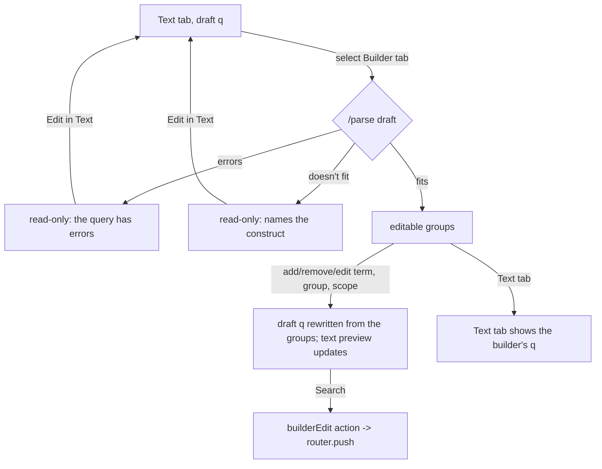

# Concept-group builder — design

Status: **reviewed**, handed off after the heuristic pre-pass · Backlog: TASK-033 → TASK-043 (tests in TASK-046) · Spec: 05 §Components 3,
accessibility skill §Keyboard flows 3–4 · Index: [search workspace](2026-09-27-search-workspace.md)

## Problem and job

**Persona:** newcomer student (primary), lead reviewer (secondary: to check a protocol string's structure).

**JTBD:** *When I have concept lists from my protocol (AI-system terms, trust terms, benchmark terms), I want
to enter each list as a group without writing parentheses and operators, so I can get a valid query that
does what the protocol says.*

Evidence: the review's own strings have exactly this shape (`main-7-most-updated`: three OR groups ANDed,
plus source limits); systematic-review search guidance builds strings as concept blocks (PICO-style
"OR within, AND between"). The newcomer's Boolean difficulties are an **assumption** (user-research
proto-persona), to be tested in TASK-047.

## The shape the builder edits

```
q  :=  group₁ AND group₂ AND … [AND NOT exclude-group] [AND limits…]
group := leaf OR leaf OR …          (one leaf is a group of one)
leaf  := word | "phrase" | stem* | stem$ , each optionally title: or abstract:
limits := the top-level filter clauses (venue:, year:, track:, status:), shown, not edited here
```

The builder reads the **server's** `ast` from `POST /parse` for the draft (it walks the tree; it never parses
text). It fits when the top-level node is an `And` (or a single group) whose children are each:
an `Or` of leaves, a single leaf, a `Not` of an `Or` of leaves / of a leaf (at most one: the Exclude row), or a
`Filter`. Anything else makes the builder **read-only**, naming the first construct that doesn't fit, in
source order, with its span:

| Construct | Why it doesn't fit | Named as |
|---|---|---|
| `Near` | proximity isn't a list of alternatives | "`trust NEAR/5 calibrat*` (proximity)" |
| an `And` inside an `Or` | a group is a list of alternatives, not a combination | "`(a AND b) OR c` (AND inside OR)" |
| an `Or` nested directly inside an `Or` (`(a OR b) OR c`) | fits: it means one list of alternatives, and the builder reads it as one group (it rewrites the text only if the group is edited) | — |
| an `And` nested directly inside the top `And` (`(a AND b) AND c`) | fits: read as more groups, as the canonical tree flattens it | — |
| more than one `Not` at the top, or `Not` of an `And` | one Exclude row only, a list of alternatives | "`NOT (a AND b)`" |
| a filter inside an `Or` | limits are top-level | "`track:workshop OR x`" |
| mixed field scopes on one leaf group written as `title:(a OR b)` | fits: each leaf keeps its own scope | — |

Because the builder writes back a string, the round-trip rule is **canonical equality**: builder → `q'` → `/parse`
→ `canonical(q') == canonical(q)` for a query that fits and wasn't edited (TASK-043 AC#1). Switching Text →
Builder → Text without an edit leaves the text **exactly as typed** (the builder is not allowed to reformat
a query the reader didn't touch).

## Flow



`q` before/after: groups `[foundation model (phrase), LLM]`, `[trustworth*, trust]`, `[benchmark]`, limits
`venue:ICLR` → draft `("foundation model" OR LLM) AND (trustworth* OR trust) AND benchmark AND venue:ICLR`. Adding
`leaderboard` to group 3 → `… AND (benchmark OR leaderboard) AND venue:ICLR`. The builder always writes
groups of two or more in parentheses, a group of one bare, phrases in double quotes, limits last in their
original text.

## States

| State | Trigger | Must show |
|---|---|---|
| Empty | Builder tab with an empty draft | one empty group with one empty term, focused; the "OR within, AND between" hint |
| Editable | draft fits | groups, Exclude row if any, limits (read-only chips), the text preview |
| Loading | `/parse` of the draft in flight when switching | the tab panel shows "Reading the query…" (after 300 ms); no controls yet |
| Read-only: errors | draft has errors | "The query has errors, so the builder can't show it." + the diagnostics summary + **Edit in Text** |
| Read-only: too complex | draft doesn't fit | "This query is too complex for the builder: `<construct>` (<kind>) doesn't fit groups of alternatives." + **Edit in Text** |
| Empty term | a term box left empty | the term is left out of `q`; a group with no terms is left out; if every group is empty the preview reads "(empty query)". Search stays enabled, as everywhere (the client never blocks a search on its own reading): the server answers `PARSE_EXPECTED_TERM` "The query is empty — type a word or phrase to search for." (pre-pass S10) |
| Pasted list in one term | a term box whose text holds `,`, `;`, `\|`, a newline, or `OR`/`or` between words | the box's default action (Enter) is **Split into `<n>` terms**, which makes one chip per item (an `or`/`OR` separator is dropped, not searched); **Keep as one phrase** is the other button (pre-pass M5) |
| Term needs quoting | a term with a space that isn't a list | written as a phrase; the chip shows the quotes and the note "searched as one phrase" so it's never silent |
| Term diagnostics | `/parse` of the builder's `q` warns or errors | the diagnostic appears under the term whose span it hits (spans map back through the builder's own write-out table) |
| Narrow | < 768 px | groups stack; term chips wrap; move buttons stay (no drag) |

## Wireframes

### B1 Editable

```
│ [ Text | Builder ]   Syntax: [native ▾]                                            [Search]  │
│ Papers must match every group. Within a group, any term is enough (OR).                      │
│                                                                                              │
│ Group 1  of 3                                          [↑] [↓] [Remove group]                │
│  ["foundation model" ×] [title:LLM ×] [+ term]                                               │
│ AND                                                                                          │
│ Group 2  of 3                                          [↑] [↓] [Remove group]                │
│  [trustworth* ×] [trust ×] [+ term]                                                          │
│       trustworth* → trustworthy, trustworthiness (after Search)                              │
│ AND                                                                                          │
│ Group 3  of 3                                          [↑] [↓] [Remove group]                │
│  [benchmark ×] [+ term]                                                                      │
│ [+ Add group]   [+ Exclude terms]                                                            │
│                                                                                              │
│ Limits:  venue:ICLR   (search first to edit them in Filters, or edit them in Text)            │
│                                                                                              │
│ Query text:  ("foundation model" OR LLM) AND (trustworth* OR trust) AND benchmark AND        │
│              venue:ICLR                                                        [Copy]        │
```
- A term chip opens an inline text box on Enter. The field scope is **on each chip** (spec 05: per term): the
  chip shows the prefix it writes (`title:LLM`), and its menu offers "title or abstract", "title only",
  "abstract only" (pre-pass S9). A wildcard term shows its expansions once a search has run.
- The Exclude row, when present, reads "Leave out papers with any of:" and is always last.
- `[↑] [↓]` reorder groups (order changes the text, never the set); there is no drag (2.5.7).

### B2 Read-only

```
│ [ Text | Builder ]                                                                          │
│ ┌ This query is too complex for the builder ──────────────────────────────────────────────┐ │
│ │ `trust NEAR/5 calibrat*` (proximity) doesn't fit groups of alternatives. The builder     │ │
│ │ shows lists of terms joined by OR, combined with AND. Your query is unchanged.            │ │
│ │ [Edit in Text]   [Show it in the text]                                                    │ │
│ └──────────────────────────────────────────────────────────────────────────────────────────┘ │
│ (groups that did fit are shown below, dimmed and not editable, so the reader sees what        │
│  the builder understood)                                                                     │
```

## Interaction spec

- **Switching** (accessibility §3): tabs, ←/→. Text → Builder: focus moves to the first term of group 1, or, when
  read-only, to the notice's heading. Builder → Text: focus moves to the editor with the cursor at the end.
  The draft is one string shared by both tabs; switching never loses or reformats it.
- **Builder edits are draft edits.** They rewrite the draft (the preview and, on return, the editor), never
  the URL. **Search** dispatches `builderEdit` with the draft (`router.push`). Typing never navigates (3.2.2).
- **Keyboard:** Tab moves between controls in reading order: group heading actions, then terms (each chip is a
  button: Enter edits, Delete removes), `+ term`, scope menu. In a term box, Enter commits and opens a new empty
  term in the same group; Esc cancels the edit; Backspace in an empty term removes it and focuses the previous
  term. `Alt+↑/↓` on a group heading moves the group (the buttons do the same).
- **Focus after removal** (accessibility §4): removing a term focuses the previous term (or `+ term` if it was
  the first); removing a group focuses the previous group's heading (or the next group's, if it was the first).
- **Announcements** (polite): "Group 2 removed. 2 groups.", "Group moved up: now group 1 of 3.", "Term trust
  added to group 2."
- **Screen reader structure:** each group is a `role=group` with the name "Group 2 of 3, any of: trustworth
  star, trust". The AND between groups is text (not colour).
- **Limits** are listed, never edited here; the Filters sidebar edits them in `q` (guarantee 3). The builder
  keeps each limit's original text when it writes `q`.

## Copy
Copy deck §Builder.

## API fields needed
`POST /parse` `ast` (with spans) and `errors`/`warnings`: exists. No gap.

## Heuristic pass
[Pre-pass](2026-09-27-heuristic-prepass.md) findings M5 (pasted lists), S8 (limits wording), S9 (scope per
chip) and S10 (empty builder) are fixed above, as are the self-check's SC-10 to SC-13 (named blocking
construct; untouched text round-trips verbatim; focus after removal; per-term diagnostics).

## As built (TASK-043)

Code: `frontend/src/builder/` (`model.ts`, `read.ts`, `terms.ts`, `write.ts`, `edits.ts`,
`concept-builder.tsx`, `query-tabs.tsx`); the workspace mounts the tabs (`search-workspace.tsx`). Where it
differs from or adds to the design above:

- **Two more blocker kinds.** The fit table implies them but BD-7 doesn't word them: a `NOT` inside a group
  (`trust (bias OR NOT fairness)`) is "NOT inside OR", and a second top-level `NOT` is "a second NOT". For
  "AND inside OR", "a limit inside OR" and "NOT inside OR" the named construct is the whole group (as in the
  table's examples); for proximity it is the `NEAR`, for "NOT of a combination" and "a second NOT" the `NOT`.
  An `OR` of only filters (main-7's `(source:… OR …)`) and a `NOT` of a filter are limits.
- **The Exclude row keeps its written place.** It is shown last, but a query read with its `NOT` elsewhere
  (`NOT (a OR b) trust`) writes it back there after an edit, so an edit elsewhere doesn't reorder the
  canonical query; a new Exclude row is written last.
- **Terms.** A term's text is written as typed when it is exactly one word, wildcard or phrase lexeme
  (checked with `lex.ts`, the server lexer's generated mirror, both alone and between `(`/`)`/spaces);
  lowercase `and`/`or`/`not` are quoted; anything else becomes one phrase (quote marks become spaces,
  backslashes go) and the chip says "searched as one phrase". A typed `title:`/`abstract:` prefix sets the
  chip's scope; the edit box holds the term without its scope. A read leaf that isn't one lexeme (a Scholar
  unquoted phrase) is written in its canonical spelling (`"large language model$"`). After writing, the
  whole string is lexed again; a term that no longer lexes as itself next to its neighbours (a LaTeX `$`
  pairing across terms) is left out and its chip says so.
- **Tabs.** ←/→/Home/End select a tab and keep focus on the tabs (so the reader can go back); a click, Enter
  or Space selects it and moves focus into the panel (the first term, the read-only notice, or the editor
  with the cursor at the end). The builder panel is mounted only while selected; the editor stays mounted.
- **Run-time check.** When the server answers for a query the builder wrote, the builder reads that `ast`
  and requires exactly its terms at the spans it wrote them, in its groups, with their scopes; otherwise it
  shows an alert ("The server reads the builder's query differently from these groups…"). The goldens make
  that unreachable for every case they hold.
- **Built in TASK-111:** the wildcard expansions under each group (and the Exclude row) after a search, and
  the parts that fit under the B2 notice. See §As built (TASK-111).
- **Tests:** `read.test.ts` (the fit rule against the backend's reading), `write.test.ts` (the write golden,
  seeded edits, the writer's rules), `concept-builder.test.tsx` (every state, keyboard, focus and
  announcements, `/parse` answered from the backend's real `ast`s), and
  `backend/tests/contract/test_frontend_builder_golden.py`. Regenerate: `(cd backend && uv run python -m
  tests.contract.test_frontend_builder_golden --write)`, then `UPDATE_BUILDER_GOLDEN=1 npm test --workspace
  frontend -- builder`.

## As built (TASK-111)

- **Expansions under each group.** `SearchView` passes the last answered `/search`'s `query.expansions` to
  the workspace, which passes it to the builder. Each term's wildcards come from the server's `ast` of the
  draft (`expansions.ts` `termWildcards`: every wildcard, phrase items included, inside the term's span,
  keyed `<stem><op>` as `search.py` keys expansions). A group shows one line per wildcard that the search
  expanded, in the Expansions row's own words (`ExpansionLine`, copy EX-2/3/5), in a list named
  "Expansions" inside the group. A wildcard the last search didn't have shows nothing; before a search
  there are none. An expansion is a fact about the index, not the query, so it stays shown while the draft
  differs from the searched query. While the server reads a builder edit, a term whose written text didn't
  change keeps its wildcards (`carryKeys`), so the other groups' lines don't flicker.
- **The parts that fit, under the B2 notice** (copy BD-11). `read.ts` `readFitting` reads each top-level
  part on its own (`readAst` is the same walk, reporting the first part that doesn't fit). The groups,
  the first fitting `NOT` as the Exclude row, and the limits are shown under the notice in a region
  "Parts that fit the builder", dimmed (`text-muted-foreground`, dashed borders) and with no controls:
  terms are `<code>`, not buttons, so Tab goes from the notice's two buttons straight out of the panel.
  Groups are "Group `<n>`" with no "of `<m>`", since the parts that don't fit aren't counted. "AND NOT"
  appears only after a group. Nothing is shown when no part fits (a top-level `NEAR` or `OR` that doesn't
  fit).
- **Tests:** `read.test.ts` (`readFitting` equals `readAst`'s shape on every golden query that fits, and
  keeps the fitting parts of blocked ones), `expansions.test.ts`, `concept-builder.test.tsx` (per-group
  lines and their screen-reader text, none before a search, kept through an edit while `/parse` is held,
  `+N more` reachable by Tab; the read-only parts, their names, the panel's Tab order, the Exclude row
  with and without a group above it), and `search-view.test.tsx` (the `/search` answer reaches the
  builder).

## Open questions
1. Should the builder offer NEAR between two groups? Not in M3b (spec 05 defines rows as OR lists); revisit
   after TASK-047.
2. Resolved in TASK-043: the `main-7-most-updated` test proves that a pasted Scholar-mode string with
   `source:` limits is read through the Scholar `ast` and retains the original `source:` text on write.
