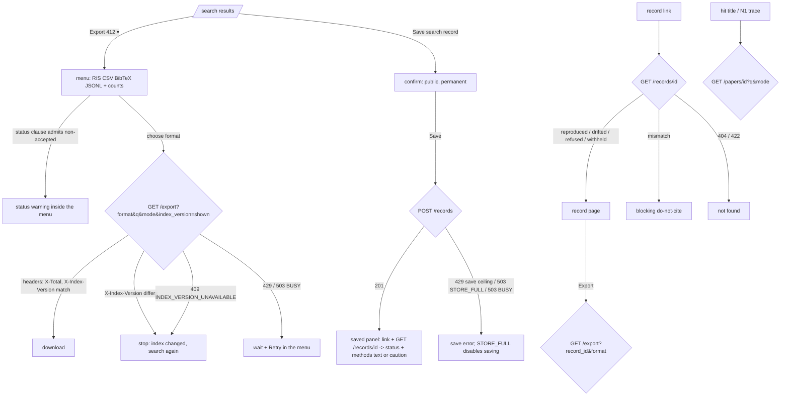

# Export menu, search records and the paper page — design

Status: **reviewed**, handed off after the heuristic pre-pass · Backlog: TASK-033 → TASK-044 (export, save, `/record/[id]`, methods text), TASK-042
(`/paper/[id]`), tests in TASK-046 · Spec: 05 §Pages, §Components 7–8, §Error handling; 04 §Exports, §Search
records · Index: [search workspace](2026-09-27-search-workspace.md)

## Problem and job

| Persona | JTBD | Risk removed |
|---|---|---|
| Lead reviewer | When my search is final, I want to export exactly the set I see into Covidence and save a citable record, so the methods section and the screening library agree | an export that holds rejected papers screeners can't recognise; a methods text with a prefix `index_version`; a drifted count reported as the original |
| Second screener | When I screen an unexpected record, I want to trace it back to the search and see which terms matched it | can't tell a wildcard expansion from a real match |
| Methods peer reviewer | When I check a paper's search, I want to open its record, see whether it replays, and understand any difference | `drifted` with no explanation; a `mismatch` that looks normal |

**Evidence.** The Covidence hand check ([`docs/results/2026-09-27-covidence-check.md`](../results/2026-09-27-covidence-check.md),
observed 2026-09-27): Covidence's screening card shows title, abstract, authors, year, source and DOI, but
**no keywords, no notes and no URL**. So a screener can't see a paper's status or track, or the `N1`
provenance. Covidence merges our record with copies from other databases (another type, a volume, initials),
but **not** with a copy dated a different year. PRISMA 2020 / PRISMA-S reporting rules come from the
`prisma-reporting` skill. Everything else is the spec.

## Flow



## States

| State | Where | Must show |
|---|---|---|
| Export menu, all accepted | `/search` | four formats, each with `412 papers`, RIS guidance |
| Export menu, non-accepted included | `/search` | the status warning with each non-accepted count (below) |
| Export in progress | menu item | "Preparing 412 papers…" with the item disabled; Esc closes the menu, the download continues |
| Export index changed | menu | stop notice naming both versions; nothing downloaded |
| Export rate limited / busy | menu | message, countdown, Retry |
| Save confirm | popover | public-and-permanent notice, the query that will be saved |
| Saved, citable | panel | link, status, methods text, Copy |
| Saved, bootstrap / not recorded | panel | link, the caution, **no methods text** |
| Save refused | panel | 429 / 503 message; `API_RECORDS_STORE_FULL` disables Save for the session |
| Record: reproduced | `/record/[id]` | status line, full record, methods text, exports |
| Record: drifted | `/record/[id]` | reason (changed inputs), `+added / −removed` with the diff, methods text from the **recorded** values |
| Record: membership-identical | `/record/[id]` | drifted with `+0 / −0` = "membership-identical" |
| Record: could not be re-run | `/record/[id]` | "could not be re-run: `<code>`", no counts |
| Record: withheld | `/record/[id]` | the spec's two sentences, never reproduced |
| Record: mismatch | `/record/[id]` | blocking "do not cite — replay mismatch", **no methods text, no export** |
| Record: bootstrap / null citable | `/record/[id]` | caution, no methods text, exports stay |
| Record: index gone | `/record/[id]` | exports disabled with reason |
| Record: not found | 404 or 422 `API_BAD_PARAM` | not-found state |
| Record: can't load now | 429 / 503 `API_BUSY` / `API_INDEX_NOT_LOADED` / non-JSON 5xx | wait or retry state (the record is unreadable until the replay runs: Open questions 3) |
| Paper: matched | `/paper/[id]?q` | match line, highlights |
| Paper: not matched | `matched: false` | "doesn't match", nothing lit |
| Paper: direct link | no `q` | the record, no match line |
| Paper: query refused | 422 / 429 with `q` | refetch without `q`, one-line notice |
| Paper: not found | 404 / 422 `API_BAD_PARAM` | not-found state |
| Narrow | all | single column; methods text wraps; tables become definition lists |

## Export menu (TASK-044)

### E1 Menu

```
                                   [Export 412 ▾] [Save search record]
                                   ┌──────────────────────────────────────────────────────┐
                                   │ Export all 412 papers {total} of this search          │
                                   │ from index a1b2c3d4e5f6 {index_version}               │
                                   │ ─────────────────────────────────────────────────────│
                                   │ RIS — for Covidence, Zotero, EndNote     412 papers   │
                                   │ CSV — spreadsheet, UTF-8                 412 papers   │
                                   │ BibTeX                                   412 papers   │
                                   │ JSONL — every field, one line each       412 papers   │
                                   │ ─────────────────────────────────────────────────────│
                                   │ ▸ Importing into Covidence                            │
                                   └──────────────────────────────────────────────────────┘
```
- The count is the search's `total`, which `X-Total` must equal (spec 04). An export is never paged or
  truncated; the menu says "all".
- Request: `GET /export?format=<f>&q=<q>&mode=<mode>&index_version=<shown index_version>`. Pinning the version
  shown means a hot swap can't hand over a different set: it's 409 `API_INDEX_VERSION_UNAVAILABLE` instead.
- The client reads the response **headers first**. If `X-Index-Version` ≠ the shown version it aborts the body
  and shows E3. If the version is the same but `X-Total` ≠ the shown total, it aborts and shows the bug message
  EX-E3b (same index, different count: guarantee 4 broken, never worded as an index change; pre-pass S3).
  Otherwise it streams the body to a file named by
  `Content-Disposition`.
- The button is disabled with a reason while the results are stale (W6: "The results shown are from an
  earlier query — search again or restore it before exporting.") or the editor is dirty (`DRAFT_DIRTY`).

### E2 Status warning (inside the menu, above the formats)

Shown when the searched `q`'s status clause admits anything other than `accepted`: `filters.status.values`
includes another value, or the clause isn't toggleable (negated, nested, several), in which case the
warning has no numbers.

```
│ ⚠ This export includes papers that were not accepted: 88 rejected, 3 withdrawn.           │
│   Covidence doesn't show a paper's status to screeners (no keywords or notes on the        │
│   screening card), so they can't be told apart there. To screen accepted papers only,      │
│   keep the default status filter. [Show the Status filter]                                  │
```
- Counts are `facets.status[value]` for each value in the clause other than `accepted` (exact: the facet is
  counted with every other filter applied). They are listed, never summed.
- **Show the Status filter** closes the menu and moves focus to the sidebar's Status heading (on narrow screens,
  opens Filters first). The design never changes `q` from the export menu.
- The warning is advice, not a block: CSV and JSONL users filter on the `status` column, and Zotero shows it.
- **The same warning for track** (pre-pass S2): the Covidence check found the track isn't visible to screeners
  either (keywords aren't shown). When the searched `q`'s track clause is a user limit admitting values outside
  the default (`workshop`, `competition`, …), a second line lists them with `facets.track[value]` counts (copy
  EX-E3a) and **Show the Track filter**.

### E3 Index changed / unavailable

```
│ ✖ The index changed after this search: the export would come from index 9f8e7d6c5b4a,       │
│   not a1b2c3d4e5f6, so it could hold different papers. Nothing was downloaded. Search again  │
│   to see the current results, then export. [Search again]                                    │
```
409 `API_INDEX_VERSION_UNAVAILABLE` uses the same block with "Index a1b2c3d4e5f6 is no longer served here".

### E4 Importing into Covidence (disclosure in the menu)

Copy deck §Export has the full text. Points, in order: import into *Title and abstract screening*; screeners
won't see status, track or our notes, so filter before exporting; each record's Notes (`N1`) and CSV
columns name this search (index, query hash, export date) for tracing; Covidence merges copies from other
databases but not a copy dated a different year, so check its duplicate list; Covidence's duplicates go in
PRISMA's "duplicates removed" box, never added to openproceedings' dedup statement.

## Save search record (TASK-044)

### S1 Confirm

```
                                  [Save search record]
                                  ┌─────────────────────────────────────────────────────┐
                                  │ Save this search as a permanent record?              │
                                  │ `("foundation model" OR LLM) AND trust*` · native    │
                                  │ 412 papers · index a1b2c3d4e5f6                      │
                                  │ Anyone with the link can see the record, including   │
                                  │ the query text. It can't be edited or deleted.       │
                                  │                                   [Cancel] [Save]    │
                                  └─────────────────────────────────────────────────────┘
```
- Saves the **searched** `(q, mode)`, never the draft (`POST /records {q, mode}`). Disabled with the reason
  while dirty or stale, as Export. Focus starts on **Save**; before dispatch, Esc cancels and returns focus
  to the button. While the save is pending, Esc or **Close** dismisses the dialog but the irreversible
  request continues under a page-scoped owner and its eventual outcome appears beside the button even if
  the results control unmounts and returns. The owner settles each `(q, mode, index_version)` independently,
  so beginning another save cannot discard the first request's late answer. After 30 seconds without an answer
  it shows SV-9 without aborting; a later valid 201 still restores the saved link. The replay GET starts only
  while the saved panel is mounted.

### S2 Saved

```
│ ✔ Saved as search record Ab3dE5fG7hJ9 {record_id}                                       │
│   https://openproceedings.example/record/Ab3dE5fG7hJ9 {origin + page}   [Copy link]      │
│   Reproduced just now on index a1b2c3d4e5f6.                     [Open record page ▸]    │
│   Methods text                                                    [Copy methods text]     │
│   ┌──────────────────────────────────────────────────────────────────────────────────┐  │
│   │ We searched openproceedings on 2026-09-27 (index `a1b2c3d4e5f6`, built from a     │  │
│   │ run 2026-09-18 to 2026-09-20) with the string `…`, which identified 716 records … │  │
│   └──────────────────────────────────────────────────────────────────────────────────┘  │
```
- **Index check** (pre-pass M3): `POST /records` takes only `{q, mode}`, so a hot swap between the search and
  the save would freeze the query on another index. The panel compares the 201's `index_version` with the
  shown one; if they differ, it leads with a warning block (copy SV-8) naming both versions and the record's
  own total (from the follow-up `GET`), before the link. Built since (TASK-091): the save can send the shown
  `index_version` on `RecordRequest`, and a moved index is then 409 `API_INDEX_VERSION_UNAVAILABLE` with
  nothing saved, like the export (copy EX-E4's wording applies).
- After the 201, the panel calls `GET /records/{id}` (one replay, charged the export weight) for the status
  and the fields the methods text needs. If that call is refused (429/503), the panel keeps the link and
  says "The record is saved. Its methods text is on the record page." (Open record page ▸).
- The link is the site origin + `page` from the 201 (`/record/<record_id>`).
- For a record that isn't citable, the methods box is replaced by the caution (R6).

### S3 Save refused or outcome unknown

| Response | Panel text | After |
|---|---|---|
| 429 `API_RATE_LIMITED` (save ceilings) | the server message (it says whether the instance or the network is at its ceiling) + countdown | Save re-enabled at 0 |
| 503 `API_RECORDS_STORE_FULL` | "Saving search records is paused on this instance: its record store is full. Your search, exports and existing records still work." | Save disabled for the session with that reason |
| 503 `API_BUSY` | the server message + countdown | Retry |
| 503 `API_INDEX_NOT_LOADED` | the server message | Retry (the index dependency refuses before a record can commit) |
| 422 (the query no longer runs, e.g. a hot swap made a wildcard over-cap) | the diagnostics, as W6 | — |
| No usable response, or 500 `API_INTERNAL` | SV-9: the outcome is unknown and the server may already have created the permanent record | No Retry; the same `(q, mode, index_version)` stays disabled on this page |

## Record page `/record/[id]` (TASK-044)

### R1 Reproduced

```
┌ Search record Ab3dE5fG7hJ9 ──────────────────────────────────────────────────────── [Copy link] ┐
│ ✔ Reproduced on 2026-09-27: the same index and query version give the same 412 papers and the   │
│   same exclusions.                                                                               │
├─────────────────────────────────────────────────────────────────────────────────────────────────┤
│ Query as typed      `("foundation model" OR LLM) AND trust*`            [Copy] · native syntax   │
│ Identification      `("foundation model" OR llm) AND trust*`            [Copy]                   │
│ string                                                                                           │
│ Default filters     `track:(datasets_benchmarks OR main OR position)` `status:accepted`          │
│ Canonical query     `(…) AND track:(…) AND status:accepted`             [Copy]                   │
│ Index version       a1b2c3d4e5f6 {index_version, the whole value}       [Copy]                  │
│                     tokenizer 2 · query version 2 · snapshot {snapshot_hash, whole} · schema {…}  │
│ Searched            2026-09-25 14:03:11 UTC {searched_at}                                        │
│ Crawl run           2026-09-18 to 2026-09-20 {crawl_dates["*"]}                                  │
│ Records             716 identified · 304 removed before screening · 412 screened {total}         │
│ Removed before      212 workshop · 4 competition · 88 rejected                                   │
│ screening           unclassified: 0 track unknown · 0 status unknown                             │
│ Expansions          trust* → trust, trusted, trusting, trustworthiness, trustworthy, … +3 more   │
│ Warnings            (none)                                                                       │
│ Deduplication       1,204 cross-source records merged at ingest; look-alike pairs kept apart:    │
│                     0 by track, 3 by venue-year; 2 ambiguous, not merged {dedup}                 │
├─────────────────────────────────────────────────────────────────────────────────────────────────┤
│ Methods text                                                           [Copy methods text]       │
│ We searched openproceedings on 2026-09-25 (index `a1b2c3d4e5f6`, built from a crawl run 2026-09-18│
│ to 2026-09-20) with the string `…`, which identified 716 records with no limits. Default filters │
│ `track:(datasets_benchmarks OR main OR position)` and `status:accepted` removed 304 of them      │
│ before screening (212 workshop, 4 competition, 88 rejected); that count includes 0 unclassified │
│ records (track or status unknown), itemised separately. Cross-source duplicates were merged at   │
│ ingest, before indexing (merge counts, and look-alike pairs kept apart by track or venue-year,  │
│ are in the search record). Database scope: coverage report for snapshot `7c1e…`. 412 records    │
│ were screened. Search record: https://…/record/Ab3dE5fG7hJ9.                                     │
├─────────────────────────────────────────────────────────────────────────────────────────────────┤
│ Export the 412 papers this record cites, from index a1b2c3d4e5f6:                                │
│ [RIS] [CSV] [BibTeX] [JSONL]      ▸ Importing into Covidence                                     │
└─────────────────────────────────────────────────────────────────────────────────────────────────┘
```
- Every value is the **recorded** one (`record.*`), never the replay's, except the status block.
- Versions and hashes are shown in full (monospace, `break-all`), each with Copy.
- Crawl-window wording follows `crawl_dates_kind["*"]` (copy deck §Record). A v1 record (`crawl_dates_kind`
  null) reads "Collected" with the dates and no kind.
- Exports call `/export?record_id=<id>&format=<f>` (never `q`): the record's stored ids, from its own index.
  The row states the count (`record.total`) before the click.

### R2 Drifted

```
│ ⚠ Drifted: this instance no longer has index a1b2c3d4e5f6, so the search was re-run on index     │
│   9f8e7d6c5b4a. It now finds 421 papers: +12 / −3 against the record.                            │
│   What changed:  snapshot_hash  7c1e… → 0d4b…   the corpus (papers added or re-crawled)           │
│                  query_version  2 → 3           the query rules                                    │
│   [See the 12 added and 3 removed papers ▾]                                                        │
│   Removed before screening on re-run: 219 workshop · 4 competition · 90 rejected                  │
│   (recorded: 212 workshop · 4 competition · 88 rejected)            {replay.excluded, record.excluded}│
│   Cite the recorded counts below; they describe the search as it was run on 2026-09-25.           │
```
- **Exclusions on re-run** (pre-pass M4): when `replay.excluded_match` is false, the block itemises
  `replay.excluded` beside the recorded buckets (copy RC-3a), unclassified per map; when true it says "same
  exclusions". A refused or withheld replay (counts null) shows neither.
- Membership-identical (`membership_identical: true`): "+0 / −0: the re-run finds exactly the recorded
  papers (membership-identical), though the index or query version changed."
- The diff disclosure pages `GET /records/{id}/diff` (50 per page): two lists, "Added (12)" and "Removed (3)",
  each item a title linking to `/paper/<id>` or, when `title` is null, the id and "(not in index 9f8e…)".
- Drifted is styled `--warn-*` with the ⚠ glyph, never like reproduced.

### R3 Could not be re-run / withheld

```
│ ⚠ Drifted — could not be re-run: `WILDCARD_TOO_MANY_EXPANSIONS`. No counts were compared.        │
│ ⚠ Could not be re-run: `API_TOO_MANY_VERIFIED_CLAUSES` — this instance's limit is below the      │
│   record's 18 position-verified clauses. The record and its exports are unchanged.                 │
│ ⚠ Could not be re-run: `API_QUERY_TOO_COSTLY` — its position checks would read more documents    │
│   than this instance allows in one query. The record and its exports are unchanged.                │
```
- `refused` set → counts null → no `+/−` line, never "membership-identical", never reproduced.

### R4 Mismatch (blocking)

```
┌──────────────────────────────────────────────────────────────────────────────────────────────┐
│ ✖ Do not cite — replay mismatch                                                               │
│ Re-run on the same index (a1b2c3d4e5f6) and query version (2), this search gives different    │
│ papers or exclusions than the record holds. That should never happen: it is a bug in          │
│ openproceedings, not in your search. Don't cite this record or its counts, and don't export   │
│ it. Report it ▸ (with the record id).                                                          │
│ [Show the record's details anyway ▾]                                                           │
└──────────────────────────────────────────────────────────────────────────────────────────────┘
```
- No methods text and no export buttons are rendered (not merely disabled). The details disclosure shows the
  fields for a bug report, each with a "recorded" label.

### R5 Index gone (exports)
When `replay.index_version` ≠ `record.index_version` (the record's index isn't here): export buttons disabled,
described by "Index a1b2c3d4e5f6, which this record's papers come from, isn't on this instance, so they
can't be exported here. The record and its methods text are still valid."

### R6 Bootstrap corpus / not recorded
Replaces the methods text:
```
│ ⚠ bootstrap corpus (sources: ris): these counts describe that corpus, not a database; they are  │
│   not PRISMA identification numbers.                                                              │
```
`identification_citable: null`: "not recorded whether this index is a bootstrap corpus: these counts may not
be PRISMA identification numbers". Both strings are the CLI's (spec 05, prisma-reporting); exports stay.

### Methods text rules (TASK-044 AC#1)
Generated only when `identification_citable === true` and `status !== "mismatch"`, from the **recorded**
fields, following spec 05 §Components 8 verbatim (change it only by spec PR):
1. The full `index_version`, never a prefix. Search date = `searched_at`'s UTC date; crawl clause from
   `crawl_dates["*"]` from–to by kind (`crawl`, `scholar_query_dates`, `mixed`, and since TASK-077 `scholar_query_dates_utc` and `mixed_utc`; spec 05 §Components 8), never one date.
2. The string: `identification_query`; `""` → "all indexed records"; all-negative (the page asks `POST /parse`
   for it and gets `PARSE_ALL_NEGATIVE`) → cite `canonical` and describe the set as "`<canonical>` without its
   default filters".
3. Limits clause: every non-default filter the user wrote, or "with no limits".
4. Default filters and the removed count with the itemised buckets; the unclassified count, itemised.
5. The input as typed when it differs from the identification string; in Scholar mode the translation
   sentence with one clause per translation code **actually recorded**.
6. Deduplication, database scope (`snapshot_hash`), records screened (`total`), record URL.
Counts come from the record: identified = `total + excluded.total` and unclassified =
`excluded.track.unknown + excluded.status.unknown` (see API fields needed).

### As built (TASK-044)
- **Export menu.** Menu-button semantics as specified; the heading and each warning are the `role=menu`'s
  `aria-describedby`, and the warning's **Show the …filter** and the Covidence disclosure are outside the menu
  (reached by Tab), since a menu holds only actions. The formats stay disabled ("Checking the query's filters…")
  until `/parse` has reported on the shown query, so a status warning can't be missed by a fast click. A value
  the clause admits but the export holds none of (facet 0) isn't listed; with none left, there is no warning.
  The popup opens from the button's left edge. After a failed export the notice stays in the menu until the
  next export starts.
- **Save.** The request always carries the shown `index_version` (TASK-091), so SV-8 appears only if a 201
  names another index anyway. A 422 on save lists the diagnostics in the panel ("The search couldn't be saved:
  it no longer runs on this index.") rather than on the editor. The saved panel's non-reproduced status reuses
  the record page's line.
- **Record page.** The stored read (`?replay=false`) renders at once; the replay is then requested
  automatically (no button: the e2e flow expects `reproduced` on arrival). The methods text and the exports are
  drawn only once the replay has answered or failed to run, so a `mismatch` never shows them even briefly.
  "Replay: waiting" (429, `API_BUSY`) and "Replay: not checked" (anything else) keep the recorded values,
  methods text and exports, with Retry. The diff opens on request (it costs a replay). Default filters on the
  page come from the same `/parse(canonical)` report as the methods text; under another query version the row
  says they couldn't be separated.
- **Strings added here that the copy deck doesn't have** (for the ux-writer): "Checking the query's filters…",
  "Nothing was downloaded." (announcement), "Checking the record: re-running its search on this instance…",
  "Replay: waiting / not checked — re-running this record's search to check it was refused just now (…): … The
  recorded values below stand as recorded.", "Writing the methods text…", "Loading the search record…", "The
  record couldn't be loaded just now: …", "Loading the differences…", "None on this page.", the save's
  index-moved and 422 messages, the Default filters row's "Not separated from the canonical query here …", and
  the methods-text variants listed in spec 05 §Components 8 *As built*.

## Paper page `/paper/[id]` (TASK-042)

### P1 Matched (reached from a hit)

```
│ ◂ Back to results                                                                             │
│ # **TrustLLM**: **Trustworthiness** in Large Language Models                                  │
│ [ICML] [2024] [main] [poster]                                                                 │
│ Lichao Sun, Yue Huang, … (all authors)                                                         │
│ ✔ Matches `("foundation model" OR LLM) AND trust*` (native): matched terms are highlighted.   │
│ ## Abstract                                                                                   │
│ Large language models (**LLMs**) … the **trustworthiness** of **LLMs** …                      │
│ ## Links   OpenReview · PDF · Proceedings · DOI                                                 │
│ ## Identifiers  op:icml:2024:abc123 [Copy] · venue id ICML.cc/2024/Conference · content hash … │
│ ## Where each field came from  (provenance)                                                    │
│ | Field | Value | Source | Fetched | Evidence |                                                │
│ | title | TrustLLM: … | openreview | 2026-09-18 10:02 UTC | forum ▸ |                          │
│ Index a1b2c3d4e5f6 · tokenizer 2 · query version 2                                            │
```
- Calls `GET /papers/{id}?q=<q>&mode=<mode>` (the `q` rides in the URL); draws `highlights` with the same
  component as the result list (API spans only).
- A paper that isn't `accepted` gets a status line under the badges, naming the venue with the same venue
  string as the RIS `N1`:
  "Status: rejected — submitted to International Conference on Learning Representations (ICLR 2024), not in
  its proceedings."
- "Back to results" is history back when the previous entry is this `/search`, otherwise a link to
  `/search?q=&mode=`.
- **As built (TASK-042):** "Back to results" is always the link `/search?q=&mode=` (page 1; `/search` for a
  direct link): with `Referrer-Policy: no-referrer` the page can't tell where it was reached from. The status
  line first named the venue as `<venue> <year>` ("submitted to ICLR 2024"), because the conference's full
  name was only in the backend's `vocab.CONFERENCES` era table. Since TASK-112 it reads the API's
  `paper.venue_name`, so it reads as the example above, with the venue string RIS `T2` and the first `N1`
  use. Provenance values that are lists are joined with `; `; a claim's `url` is a "source ▸" link after its
  evidence text. The query in the URL is fetched as
  `["paper", id, q, mode]`.

### P2 Not matched (`matched: false`)
"✖ Doesn't match `<q>` (native). Nothing is highlighted. A filter may remove it (for example the default
track or status filter), or it lacks a term the query requires." The rest of the page is the same.

### P3 Direct link (no `q`)
No match line, no highlights, nothing about a query.

### P4 Query refused
The `q` call returned 422 or 429: the page fetches `GET /papers/{id}` without `q` and shows
"ⓘ The query in this link couldn't be run (`WILDCARD_TOO_MANY_EXPANSIONS`), so the paper is shown without
highlights." (for 429: "…couldn't be run just now (too many requests)…"). A 503 `API_BUSY` with `q` does the
same with the busy code.

### P5 Not found
404 or 422 `API_BAD_PARAM`: "# Paper not found" + "No paper with that id in index <index_version>. The link
may be mistyped, or the paper isn't in the index this instance serves." + a link to `/search`.

## Interaction spec (keyboard and screen reader)

| Component | Keyboard | Screen reader |
|---|---|---|
| Export button | menu button (`aria-haspopup="menu"`); ↓ opens, arrows move, Enter chooses, Esc closes and returns focus | name "Export 412 papers"; items "RIS, for Covidence, Zotero, EndNote, 412 papers" |
| Status warning | not a menu item (a menu holds only actions): it is the menu's description (`aria-describedby`), and a one-line static copy ("Includes 88 rejected, 3 withdrawn papers ▸") sits beside the Export button while the menu is closed, so it can be read without opening the menu | read once when the menu opens |
| Export progress | the item is `aria-disabled`, text "Preparing…" | polite "Export started: 412 papers, RIS." then "Download ready." |
| Save confirm | dialog (`role=dialog`, `aria-modal`), focus trapped; Esc cancels before dispatch, or closes while an irreversible save finishes | title "Save this search as a permanent record?" |
| Saved panel | focus moves to its heading; Copy buttons announce "Copied" | the status sentence is read with the heading |
| Record status | the status block is the first heading's description; on mismatch it is `role=alert` | the glyph has text: "Reproduced", "Drifted", "Do not cite" |
| Diff disclosure | button `aria-expanded`; lists with `h3` "Added (12)", "Removed (3)"; paging buttons | — |
| Methods text | a read-only region with Copy; not a textarea (no accidental edits) | read as prose |
| Paper provenance table | a real `<table>` with `<th scope>`; on < 768 px, a definition list per claim | — |

## Copy
Copy deck §Export, §Save, §Record, §Paper.

## API fields needed

| Need | Field | Status |
|---|---|---|
| export count and pinning | `total`, `index_version`, `X-Total`, `X-Index-Version`, `Content-Disposition` | exists |
| status counts for the warning | `facets.status`, `/parse` `filters.status` | exists |
| record status, changes, counts, diff | `RecordResponse.replay`, `/records/{id}/diff` | exists |
| citability, crawl kind, sources, dedup | `SearchRecord.identification_citable`, `crawl_dates_kind`, `sources`, `dedup` | exists |
| **identified total** and **unclassified total** for the methods text and the record's Records line | `record.identified_total`, `record.unclassified_total` (and the replay's, and `SearchResponse`'s top-level pair) | **exists** (TASK-090; pre-pass S1): derived server-side, equal to what `op search` prints, so the UI adds no numbers. Everywhere else the page itemises unclassified per map |
| the default clauses and the user's limit clauses as text | `/parse(canonical)` `defaults` + `filters[*].span` sliced from `canonical` | **works only while `replay.query_version` equals the record's**; otherwise the page cites `canonical` and says the clauses couldn't be separated. Proposed: store `default_clauses` and `limit_clauses` in the record body (v3), or return them at read |
| a record readable without a replay (when the replay is refused for load) | `GET /records/{id}?replay=false` (`replay: null`, one token without `include=ids`, answered during `API_BUSY`) | **exists** (TASK-091; pre-pass S4; decision-014): the page renders the recorded fields and methods text with "Replay: waiting" during a 429 or `API_BUSY` |
| the index the save ran on vs the one shown | 201 `index_version`; `RecordRequest.index_version` | exists; the save sends the shown index_version and a moved index is 409 `API_INDEX_VERSION_UNAVAILABLE` with nothing saved (TASK-091; pre-pass M3) |

## Heuristic pass
[Pre-pass](2026-09-27-heuristic-prepass.md) Musts M3 (save on a swapped index) and M4 (exclusions on re-run)
are fixed above, with Shoulds S1–S4; so are the self-check's SC-20 to SC-24 (export status warning, export
pinned to the shown index, drifted never styled as success, mismatch renders no methods text or export, save
confirmation names permanence and publicity).

## Open questions
1. Methods text as plain text with backticks (spec 05 verbatim) vs a LaTeX or Word-friendly copy. Keep the
   spec's form in M3b; TASK-047 asks reviewers what they paste into.
2. The export menu's status warning lists counts from `facets.status`; if TASK-047 shows reviewers want one
   number, that needs an API field, not a client sum.
3. ~~A record page during `API_BUSY` or a 429 shows nothing of the record, because the record comes only with
   a replay.~~ Resolved by TASK-091: `GET /records/{id}?replay=false` (decision-014) gives the recorded fields
   and methods text while the replay waits.
