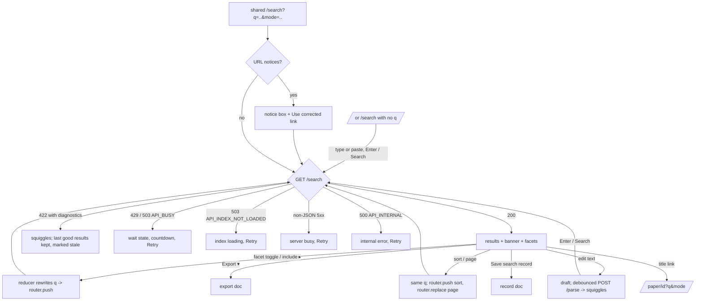

# Search workspace (`/search`) — design

Status: **reviewed**, handed off after the heuristic pre-pass (its 8 Musts fixed below; no open severity 3–4 finding) · Backlog: TASK-033 → TASK-041,
TASK-042, TASK-046 · Spec: 05 §URL is state, §`/search` layout, §Components 1, 2, 4, 5, 6, §Error handling

This is the first of six M3b design docs. The others:

| Doc | Covers | Built by |
|---|---|---|
| this one | `/search`: editor, diagnostics, expansions, translations, tree, sidebar, exclusion banner, results, paging, every error state, `/` | TASK-041 (editor, diagnostics, tree, URL notices), TASK-042 (sidebar, banner, results, paging, API error states) |
| [concept-group builder](2026-09-27-concept-group-builder.md) | the Builder tab | TASK-043 |
| [export, records and paper page](2026-09-27-export-records-and-paper.md) | export menu, save search record, `/record/[id]`, methods text, `/paper/[id]` | TASK-044 (export, save, record), TASK-042 (paper page) |
| [coverage and syntax help](2026-09-27-coverage-and-syntax-help.md) | `/coverage`, `/help/syntax` | TASK-045 |
| [copy deck](2026-09-27-copy-deck.md) | every user-facing string, in ux-writer voice | all of the above |
| [heuristic pre-pass](2026-09-27-heuristic-prepass.md) | usability-auditor findings and their dispositions, walkthroughs | — |

TASK-046 tests the critical cross-stack journey plus representative success, error, disclosure, builder,
dialog, paper, record, coverage and syntax states. Its targeted Playwright flows cover the primary keyboard
interactions; component tests cover the remaining state and keyboard matrices below.

## Problem and job

**Evidence base.** No interviews: TASK-033 was re-scoped on 2026-09-27 to build the whole system before any
human study (TASK-032, TASK-047, TASK-055, TASK-056 come after). The design rests on:
- spec 05 and the guarantees of spec 00 (the requirements);
- the `user-research` proto-personas and JTBD (**assumptions** until TASK-047's usability round);
- systematic-review practice: PRISMA 2020 flow and PRISMA-S reporting (`prisma-reporting`), and the
  Covidence workflow (search → export RIS → dedup → import → title/abstract screening);
- one piece of **observed evidence**: the 2026-09-27 hand check
  ([`docs/results/2026-09-27-covidence-check.md`](../results/2026-09-27-covidence-check.md)). Covidence's
  screening card shows no keywords, notes or URLs, so **a screener can't see a paper's status**. A rejected
  or withdrawn paper must be kept out before import, by the default `status:accepted` filter. This drives
  the export menu's status warning and the "Status" sidebar's defaults;
- the heuristic pre-pass in [2026-09-27-heuristic-prepass.md](2026-09-27-heuristic-prepass.md).

**Personas served here** (user-research skill):

| Persona | Job on `/search` (JTBD) | Risk this page must remove |
|---|---|---|
| Lead reviewer | When my protocol string was written for Scholar, I want to run it unchanged and see any translation, so I can report one search across sources. When I get a count, I want to see what the tool left out and why, so I can fill PRISMA's "removed before screening" box. | Reporting a count that silently included workshops, rejected papers or stemmed matches |
| Newcomer student | When I turn concept lists into a Boolean string, I want errors explained at the place they occur, so I can fix the query without knowing the grammar | Lowercase `or`, mixed AND/OR, `be*`, a pasted smart quote |
| Second screener | When I screen an unexpected record, I want to see which terms matched it, so I can judge whether the string is too broad | Can't tell a wildcard expansion from a real match |
| Methods peer reviewer | (arrives via a record link; see the record doc) | — |

**Journey position.** `protocol → draft strings → **run search, inspect, refine** → **export RIS** → dedup →
Covidence → screening → PRISMA → methods → replay`. `/search` owns the two bold stages; the record page owns
the last three.

## Flow



**`q` before and after each action** (the reducer's exact output; goldens in
`frontend/src/lib/filter-clause-golden.json` and `wrap-golden.json`):

| Action | `q` before | `q` after |
|---|---|---|
| Submit | (draft) `trust* AND benchmark` | `trust* AND benchmark` (page reset to 1) |
| Tick `workshop` (track is the default) | `trust* AND benchmark` | `(trust* AND benchmark) AND track:(datasets_benchmarks OR main OR position OR workshop)` |
| Untick `workshop` again | `(trust* AND benchmark) AND track:(datasets_benchmarks OR main OR position OR workshop)` | `(trust* AND benchmark) AND track:(datasets_benchmarks OR main OR position)` (the typed clause is edited in place, not unwrapped: see Open questions 1) |
| `[include 88 rejected ▸]` (status is the default) | `trust* AND benchmark` | `(trust* AND benchmark) AND status:(accepted OR rejected)` |
| Untick `ICML` under Venue (venue unrestricted: all three ticked) | `trust` | `(trust) AND venue:(ICLR OR NeurIPS)` (golden "unrestricted field: every value"; see Open questions 3) |
| Tick `NeurIPS` with `venue:ICLR` typed | `trust venue:ICLR` | `trust venue:(ICLR OR NeurIPS)` (golden "typed clause") |
| Sort by year, newest first | `…` | same `q`; `sort=year_desc`, page 1 |
| Next page | `…` | same `q`; `page=2` (`router.replace`) |

## States

Every row of the `ux-design` states table, plus the states the API can put this page in. W = wireframe below.

| State | Trigger | Must show | W |
|---|---|---|---|
| Empty | `/search` (no `q`) or `/` | editor focused, example strings, coverage line | W1 |
| URL notice | unknown, repeated or invalid param (`fromURL` notices) | notice box before everything, each notice's sentence, **Use corrected link** | W2 |
| Drafting | editor text ≠ searched `q`, or Syntax select ≠ `mode` | squiggles from `/parse`, diagnostics summary, "not searched yet" marker; sidebar and banner actions disabled with reason `DRAFT_DIRTY` | W3 |
| Loading | search in flight | previous results kept (`keepPreviousData`), a quiet "Searching…" line in the results header, no layout jump | W4 |
| Results | 200 | total, index version, banner, limits line, facets, hits, paging | W5 |
| Parse error | 422 with `PARSE_*`/`FIELD_*` diagnostics | squiggles, diagnostics row, last good results **marked stale** with the query they belong to | W6 |
| Too many expansions | 422 `WILDCARD_TOO_MANY_EXPANSIONS` (only `/search` knows; `/parse` doesn't expand) | squiggle on the wildcard, stem, count, fix | W7 |
| Too costly | 422 `API_TOO_MANY_VERIFIED_CLAUSES` / `API_QUERY_TOO_COSTLY` | one squiggle per slow clause, the counts per field | W7 |
| Zero results | `total: 0` | "0 papers match", canonical, **the banner** (maybe everything was excluded), expansions, tree open | W8 |
| Large set | `total` ≥ 1,000 | exact total with thousands separators, export still the whole set, paging stable, page count | W5 |
| Rate limited | 429 `API_RATE_LIMITED` | the server message, countdown from `Retry-After`, Retry (enabled at 0) | W9 |
| Busy | 503 `API_BUSY` | same as 429, busy wording | W9 |
| Index loading | 503 `API_INDEX_NOT_LOADED` | loading state, Retry | W10 |
| Not JSON | 5xx whose body isn't JSON | "busy, retry", never blamed on the query | W10 |
| Internal | 500 `API_INTERNAL` | code, message, Retry, query preserved | W10 |
| Body too large | 413 `API_BODY_TOO_LARGE` on `POST /parse` | diagnostics-row error: far too long to send | W11 |
| Index swapped | a new `index_version` in a response while results are shown | a notice naming both versions; results are the new index's | W12 |
| Sidebar blocked | `/parse` `filters[field].toggleable: false`, or the reducer refuses | the field's controls disabled, with the reason as their description | W13 |
| Narrow | < 768 px (tested at 360 and 320) | "Filters (n active)" button, banner above results, nothing hidden without a count | W14 |
| Builder read-only | AST doesn't fit | see builder doc | — |
| Record reproduced/drifted | `/record/[id]` | see record doc | — |

## Wireframes

Conventions: `ux-design` §Wireframe conventions. Numbers are labelled with the API field they come from.
`⟨…⟩` marks a live region; `{field}` an API field.

### W1 Empty (`/` and `/search` without `q`)

```
┌ openproceedings   Search  Coverage  Syntax                         (System|Light|Dark) ┐
│ [ Text | Builder ]   Syntax: [native ▾]                                      [Search]  │
│ ┌──────────────────────────────────────────────────────────────────────────────────┐   │
│ │ ▌                                                                                  │ ← focus
│ └──────────────────────────────────────────────────────────────────────────────────┘   │
│ Write words, "phrases", wildcards (bench*) and AND / OR / NOT. Filters go in the query: │
│ venue:ICLR year:2020..2026. Syntax help ▸                                               │
│                                                                                          │
│ The Trust-Evals review's main search string (Google Scholar syntax, loaded as written):  │
│  ▸ ("foundation model" OR "large language model" OR LLM OR "generative AI") AND        │
│    (trustworthiness OR trustworthy OR "trust" OR "trustworthy AI") AND (benchmark OR    │
│    leaderboard OR "evaluation framework") AND (source:"ICLR" OR … )   [Scholar syntax]  │
│ More examples (native syntax):                                                           │
│  ▸ trust* NEAR/5 calibrat*                                                               │
│  ▸ "large language model$" AND (benchmark OR leaderboard) year:2023..2026                │
│                                                                                          │
│ Index a1b2c3d4e5f6 {coverage index_version} · 1,805 records indexed {totals.records} ·   │
│ ICLR, ICML, NeurIPS {venue_years' venues} · Crawled 2026-09-20 to 2026-09-26 · Coverage ▸│
└──────────────────────────────────────────────────────────────────────────────────────────┘
```
- The first example is `main-7-most-updated` **verbatim** from `backend/tests/fixtures/queries/trust-evals.txt`
  with `mode=scholar` (loading it sets the Syntax select, which teaches the select); the others are labelled
  as plain examples, not the review's (pre-pass S11).
- An example click loads the string into the editor (a draft) and focuses the editor. It does **not** search:
  a search is always the reader's own act (3.2.2 On Input), and loading the example lets them read it first.
- The examples are the review's strings as a native-mode `q` (main-7's Scholar string needs `mode=scholar`;
  an example carries its mode and sets the mode select when loaded).
- The coverage line (`src/components/coverage/coverage-line.tsx`, TASK-110) reads one `GET /coverage`
  answer: `index_version`, `totals.records`, the venues of `venue_years` in the API's order (A–Z, as
  `/coverage` lists them) and the corpus-wide `snapshot.crawl_dates["*"]` window, worded by the same
  `corpusWindow()` as the `/coverage` header ("Crawled …", "Google Scholar searches run …" or "Collected
  … to …", or "… on <day>" when both ends fall on one day; left out when there is no `*` window). It shows only what the API serves: owner-accepted
  coverage exceptions live in the gate report, not in `GET /coverage` (spec 07 §C). While loading, or if
  the request fails, the line is left out rather than showing a placeholder.

### W2 URL notice

```
│ ⚠ This link had parameters that weren't used:                                          │
│   • `sort=random` is not a sort order — sort orders are `relevance`, `year_desc`,       │
│     `year_asc`, `title`. Sorted by `relevance` instead.                                 │
│   • `utm_source=x` was ignored — `utm_source` is not a search parameter. Search          │
│     parameters are `q`, `mode`, `sort`, `page`.                                          │
│   [Use corrected link]                                                                   │
```
- Rendered above the editor. Sentences are `describeNotice(n)` runs (code runs in monospace), in the order
  `fromURL` returns (`q` and `mode` first). **Use corrected link** does `router.replace(searchHref(state))`;
  the page never redirects on its own. The box disappears once the URL has no notices.

### W3 Drafting (text edited, not yet searched)

```
│ [ Text | Builder ]   Syntax: [native ▾]                                      [Search]  │
│ ┌──────────────────────────────────────────────────────────────────────────────────┐   │
│ │ trust or reliance AND be* AND benchmark                                           │   │
│ │       ~~        ~~~                                                               │   │
│ └──────────────────────────────────────────────────────────────────────────────────┘   │
│ ⟨1 error, 1 warning — not searched yet⟩                                   Revert edits │
│ ✖ The wildcard `be*` keeps fewer than 3 letters or digits before `*`, so it would        │
│   match too many words — use a longer stem (e.g. `bench*`, not `be*`).  Help ▸          │
│ ⚠ `or` is searched as a word — write `OR` to combine terms (operators are uppercase      │
│   only).  Help ▸                                                                         │
├───────────────┬──────────────────────────────────────────────────────────────────────────┤
│ (sidebar and banner for the searched q, controls disabled: DRAFT_DIRTY)                   │
```
- Squiggles: errors solid red wavy underline + `✖` gutter mark; warnings dotted amber + `⚠`;
  translations dotted blue + `↻`. Never colour alone: the line style and the gutter glyph differ.
- The diagnostics row lists errors first, then warnings, then translations, each in span order, each with a
  **Help ▸** link to `/help/syntax#<code in lower case>` (N10).
- **The draft is `(text, mode)`**: it is dirty while the editor text ≠ `q` **or** the Syntax select ≠ `mode`
  (pre-pass M7). "not searched yet" (or "syntax changed — not searched yet" when only the mode differs)
  shows while dirty. **Revert edits** puts `q` and `mode` back (one undo step, so Ctrl-Z brings the edit back).
- **Two interpretations, both labelled** (pre-pass M6): while dirty, the diagnostics row and the tree
  disclosure show the **draft's** `/parse` (its `ast` and warnings), headed "Draft — not searched"; a line
  above the results keeps the searched query's own state: "Searched query: `<n>` warning(s) ▸" (opens them).
  So "Show how it was read" on a draft warning opens the draft's tree, and the searched query's warnings never
  vanish while the reader types.
- **Repeated codes collapse** (pre-pass M8, Nit 6): several diagnostics with one code are one line, "9 ×" and
  the first message, expandable to all nine (each keeps its squiggle).
- **Scholar strings in native mode** (pre-pass M8): when the draft's errors include `FIELD_COMPAT_ONLY`, the
  row offers **Read as Google Scholar syntax**, which sets the Syntax select (a draft change; the reader still
  presses Search). It never rewrites the text, so the protocol string stays the record's "Query as typed" and
  the methods text gets its translation clause.
- `[Search]` is enabled even with errors: pressing it sends the query and the 422 comes back as W6 (the
  server decides; the client never blocks a search on its own reading).

### W4 Loading

```
│ 412 papers · index a1b2c3d4e5f6 · Searching…                                                  │
│ (previous hits stay, dimmed to 60% opacity, not removed; aria-busy="true" on the list)  │
```
- The header count is the **previous** total until the answer lands; "Searching…" appears after 300 ms
  (no flash on fast answers).

### W5 Results

```
┌──────────────────────────────────────────────────────────────────────────────────────────────┐
│ [ Text | Builder ]   Syntax: [native ▾]                                              [Search]│
│ ┌──────────────────────────────────────────────────────────────────────────────────────────┐ │
│ │ "foundation model" OR LLM AND trustworth* AND benchmark*                                 │ │
│ │ ········································································   │ │
│ └──────────────────────────────────────────────────────────────────────────────────────────┘ │
│ ⚠ AND binds tighter than OR, so this is read as `"foundation model" OR (LLM AND trustworth*  │
│   AND benchmark*)` — add parentheses if you meant something else.                            │
│   [Show how it was read]  Help ▸                                                             │ ← warnings
│ Expansions  trustworth* → trustworthy, trustworthiness                                        │
│             benchmark* → benchmark, benchmarked, benchmarker, benchmarkers, benchmarking,    │
│               benchmarkings, benchmarks, benchmarkset  +9 more  (the first 8 are shown)    │ ← {query.expansions}
│ ▸ How we read your query  (defaults: track, status)                                          │ ← disclosure
├───────────────────────┬──────────────────────────────────────────────────────────────────────┤
│ Filters               │ ⟨412 papers⟩ {total} · index a1b2c3d4e5f6 {index_version} [Copy]     │
│                       │ ┌──────────────────────────────────────────────────────────── (i) ┐ │
│ Venue                 │ │ excluded: 212 workshop · 4 competition · 88 rejected  {excluded} │ │
│ ☑ NeurIPS      180    │ │ unclassified: 0 track unknown · 0 status unknown                 │ │
│ ☑ ICLR         151    │ │ [include 205 workshop ▸] [include 4 competition ▸]               │ │
│ ☑ ICML          81    │ │ [include 88 rejected ▸]            {facets.track / facets.status}│ │
│                       │ └──────────────────────────────────────────────────────────────────┘ │
│ Year                  │ Limits you wrote: none                                               │
│ 2026  34 ▏2025 120    │ Sort [Relevance ▾]                   [Export 412 ▾] [Save search record]│
│ 2024 141 ▏2023  88 …  │ ──────────────────────────────────────────────────────────────────── │
│ Edit year: in the     │ ### **TrustLLM**: **Trustworthiness** in Large Language Models       │
│ query ▸               │ [ICML] [2024] [main] [poster]                                        │
│                       │ …evaluate the **trustworthiness** of **LLMs** across six dimensions… │
│ Track   (default)     │ OpenReview · PDF · Proceedings                                       │
│ ☑ main         301    │ ──────────────────────────────────────────────────────────────────── │
│ ☑ D&B           64    │ ### A **Benchmark** for Calibrated **Trust** …                       │
│ ☑ position      47    │ [NeurIPS] [2023] [D&B] [oral]                                        │
│ ☐ workshop     205    │ …                                                                    │
│ ☐ competition    4    │                                                                      │
│ ☐ unknown        0    │ ◂ Previous   Page 1 of 9 {⌈total/50⌉}   Next ▸                        │
│                       │                                                                      │
│ Status  (default)     │                                                                      │
│ ☑ accepted     412    │                                                                      │
│ ☐ rejected      88    │                                                                      │
│ ☐ withdrawn      0    │                                                                      │
│ ☐ desk_rejected  0    │                                                                      │
│ ☐ unknown        0    │                                                                      │
└───────────────────────┴──────────────────────────────────────────────────────────────────────┘
```

Component rules:
- **Mode select** label is "Syntax" (the reader's word), options "native" and "Google Scholar / PoP"
  (values `native`, `scholar`). Changing it is a draft change like editing text (it changes how `q` is read),
  so it takes effect on Search. The select sits before the editor because it says how the text is read.
- **Diagnostics row** (spec 05 §1, ui-design-system §Transparency): warnings and translations of the
  **searched** query while the draft is clean, of the draft (labelled) while it is dirty (W3); server wording
  verbatim. Absent when there are none (no "No warnings").
  `WARN_MIXED_AND_OR` carries **Show how it was read**, which opens the tree disclosure and moves focus to it,
  and **Load with parentheses**, which puts the reading the server reported (the parenthesised string in its
  message) into the editor as a draft, so the reader sees where the groups fall and edits from there (pre-pass
  S7). It is never applied automatically.
- **Translations** (Scholar mode) get their own row, before the warnings, headed "Read as native syntax:",
  one line per translation message, then `Searched as: <canonical>` in monospace with **Copy**. `COMPAT_NO_STEMMING`
  is one line naming the terms (the server already lists them).
- **Expansion chips**: one line per wildcard key of `query.expansions`, `stem → term, term, …`. Show the
  first 8, then `+N more` (a button, ≥24×24 px) that expands the line in place to the full list; never
  truncate without `+N`. A wildcard that expanded to **0 terms** reads `model$ → (no indexed words)` so a
  dead wildcard is visible (S6). A wildcard inside a phrase is keyed as the server keys it.
- **"How we read your query"** disclosure (a `<details>`-like button + region): the canonical string with
  **Copy**, the identification string with **Copy** (labelled "Identification string (what 'identified'
  counts)"), and the tree from `effective_ast`: one line per node, indented, operators in bold capitals,
  filters with their values; default clauses in `--default-clause` **with the text label `default`**.
  Closed by default; **open by default on zero results** (W8) and when `WARN_MIXED_AND_OR` is present.
- **Results header**: `412 papers` (`total`, `toLocaleString("en-US")`), `index a1b2c3d4e5f6` (the full
  `index_version`, monospace, with Copy; never a prefix, so the header and the methods text agree).
- **Exclusion banner** (spec 05 §5; ux-writing §Standing strings): always present, at the top of the results column,
  never inside the sidebar. Line 1 is the standing string `excluded: 212 workshop · 4 competition · 88 rejected`:
  the track map's buckets, then the status map's, each in the API's order (largest first), leaving out
  `unknown` and zero buckets. Line 2 itemises the unclassified records on their own line, one count per map
  and never summed: `unclassified: 3 track unknown · 0 status unknown` (always shown, zeros included, since
  both keys are always present). When every non-`unknown` bucket is 0, line 1 reads `excluded: none`
  ("nothing excluded" is also a reportable fact). Line 3 holds the include buttons, one per non-zero bucket,
  unclassified ones included (`[include 3 track unknown ▸]`). The (i) button opens the PRISMA disclosure
  (copy deck §Banner), which also gives the removed total, `excluded.total`.
- **A field that is a user limit** (not in `defaults`; pre-pass M2): its buckets are 0 by definition (only
  defaults exclude), so the banner says so instead of reading as if nothing were left out: line 1 names it,
  e.g. `excluded: 88 rejected · track: your limit applies (see Limits you wrote)`, and line 2 keeps only the
  maps still under a default. The papers the limit leaves out are counted on the **Limits line** from the
  API's facet counts (below).
- **Include buttons** label the number clicking will add: the **facet count** of that value
  (`facets.track.workshop`), not the bucket count (spec 05 §5). They differ when a paper fails both defaults:
  a rejected workshop paper sits in the `workshop` bucket (buckets are counted track first, then status), but
  including workshops still leaves the status default in place, so it isn't added. Above, the bucket says 212
  and the button says 205. The disclosure explains the difference. The button's accessible name carries the
  visible label's number, "Include 205 workshop papers" (a test checks the two agree; pre-pass M1).
- **An include that would add 0** (bucket > 0, facet 0: every such paper also fails the other default;
  pre-pass S5): the button reads `include workshop (adds 0: all 3 also fail status:accepted)` and stays
  operable, since it still changes the filter; the status include beside it is what adds them.
- **Limits line**: `Limits you wrote:` then each filter clause of the searched `q` that is **not** a default,
  i.e. a field of `/parse` `filters` whose span is non-zero-width and that is not in `defaults`, printed as its
  source text in monospace (`year:2020..2026`, `track:(main OR workshop)`). "none" when there are none. A
  field `/parse` reports as `multiple_clauses`, `nested` or `mixed_fields` has no single span: it is listed as
  "`track:` (several clauses — see the query)", so a limit is never left off the line.
  This is where an include's effect shows up: after `[include 205 workshop ▸]` the track clause moves from
  the banner to this line (spec 05 §5: it becomes a user limit). For a track, status or venue limit with a
  single clause, the line adds what it leaves out, itemised from `facets.<field>[value]` for each vocabulary
  value outside `filters[field].values` (exact: a field's facet is counted without its own clause), zeros
  omitted, never summed: `track:(datasets_benchmarks OR main OR position OR workshop) — leaves out 4
  competition · 3 unknown`.
- **Sidebar** (spec 05 §4): Venue, Year, Track, Status. Each option is a real checkbox whose label includes
  its facet count (`facets.<field>[value]`, `tabular-nums`, right-aligned). Checked = the value is in the
  field's clause (`filters[field].values`). Track and status show `(default)` after the heading while the
  field's clause is the default (`defaults` includes it). Track values display as the `/meta` vocabulary,
  with `datasets_benchmarks` shown `D&B` (accessible name "datasets and benchmarks"). A value with facet
  count 0 is listed (the vocabulary is complete) but dimmed, still operable.
  - **Year** had no reducer action when this was designed (decision-011); TASK-092 added the year actions and
    **TASK-042 built the control on them** (Open questions 2): the year facet as checkboxes with counts,
    newest first, checked when the clause's ranges admit the year (a tick is `yearAdd`/`yearRemove` of that
    one year); a "From year / To year / Set years" pair (`yearSet`); "All years" (`yearClear`); and a line
    saying what the clause admits ("Every year." / "Admits 2020..2022."). Each is disabled with
    `whyBlocked`'s reason like the other fields (`TOO_MANY_RANGES` past four ranges). "Edit `year:` in the
    query ▸" stays: if the searched `q` has a `year:` clause with a span (`filters.year`), it selects that
    clause in the editor; otherwise it appends ` year:2020..2026` to the draft with the range selected, so
    the reader sees the syntax and types over it (pre-pass S14). New string: "Type a four-digit year in both
    boxes, the earlier first." (Set years with an unreadable box).
- **Result item** (ui-design-system §Result item): `h3` title linking to `/paper/<id>?q=<q>&mode=<mode>`, with
  highlights; badges `venue · year · track · presentation`, plus a status badge only when not `accepted`
  (text, e.g. `rejected`); abstract excerpt with highlights; links OpenReview (`urls.forum`), PDF
  (`urls.pdf`), Proceedings (`urls.proceedings`), DOI (`urls.doi`), each only when present. Highlights are
  `<mark>` + bold + `--hl-*`, cut at the API spans with `hitHighlightsUtf16` (never re-matched). A paper with
  no abstract says "No abstract in the index" in muted text (not an empty line).
  - **Excerpt rule** (client display only, not matching): show the whole abstract when ≤ 600 characters;
    otherwise a window around the first highlight span, with `…` at a cut, and **Show full abstract**. The
    window is chosen from the API spans, so it never decides what matched.
- **Sort** select: `Relevance`, `Year, newest first`, `Year, oldest first`, `Title` (`relevance`,
  `year_desc`, `year_asc`, `title`). Changing it pushes the URL and resets to page 1; the set is unchanged, so
  the total and banner don't move.
- **Paging** (spec 05 leaves infinite scroll vs pages to implementation; **pages chosen**): the URL already
  carries `page`, pages keep the order stable and are shareable, and a numbered position is what a screener
  can report back ("page 3, item 12"). `◂ Previous  Page 3 of 9  Next ▸`, plus a page-number input (Enter
  jumps; out of range is refused with the reducer's `BAD_PAGE` message under the input). `router.replace`, so
  Back leaves the search instead of stepping pages. Focus moves to the results heading after a page change.

### W6 Parse error (422 with diagnostics)

```
│ ┌──────────────────────────────────────────────────────────────────────────────────┐   │
│ │ (trust OR reliance AND benchmark                                                  │   │
│ │ ~                                                                                 │   │
│ └──────────────────────────────────────────────────────────────────────────────────┘   │
│ ⟨The query wasn't searched: 1 error⟩                                                     │
│ ✖ `(trust OR reliance AND benchmark` has no closing parenthesis — add `)` where the     │
│   group ends.  Help ▸                                                                    │
├───────────────┬──────────────────────────────────────────────────────────────────────────┤
│ (sidebar of   │ ┌ Showing the last search that ran, not the query above ───────────────┐ │
│  the last     │ │ `("foundation model" OR LLM) AND trust*` · 412 papers · [Restore it] │ │
│  good search, │ └──────────────────────────────────────────────────────────────────────┘ │
│  disabled)    │ (previous results at 60% opacity, banner and header of that search)      │
```
- The URL **does** change on submit (`q` is what the reader asked for, so a shared link reproduces the error);
  the stale block names the query the shown results belong to, with **Restore it** (pushes that `q`).
- With no previous good search (a shared link with an error), the results area shows only
  "No results: the query has 1 error. Fix it above and search again." — never an empty list.
- Squiggles and the row come from the 422 `error.diagnostics` for the submitted `q`; the draft's `/parse`
  diagnostics replace them as soon as the reader edits.

### W7 Too many expansions / too costly (422 from `/search` only)

```
│ │ trust* AND tr* AND benchmark                                                      │   │
│ │            ~~~                                                                    │   │
│ ⟨The query wasn't searched: 1 error⟩                                                     │
│ ✖ `tr*` expands to 1,340 terms (more than 200) — use a longer stem.  Help ▸              │
│   Only a search can count expansions, so this appears after Search, not while typing.   │
```
- `/parse` only checks grammar; expansions are counted against the index on `/search`. The second line is the
  frontend's (copy deck §Editor), shown only for `WILDCARD_TOO_MANY_EXPANSIONS`, so the reader isn't surprised
  that the error appeared late.
- `API_TOO_MANY_VERIFIED_CLAUSES` / `API_QUERY_TOO_COSTLY`: the envelope's `message` heads the row, then one
  squiggle and one line per diagnostic ("This clause's position check would read 96,580 documents in
  abstract."). Help ▸ goes to `/help/syntax#slow-clauses`.

### W8 Zero results

```
│ ⟨0 papers match⟩ · index a1b2c3d4e5f6                                                    │
│ ┌──────────────────────────────────────────────────────────────────────────────── (i) ┐ │
│ │ excluded: 3 workshop                                                                 │ │
│ │ unclassified: 0 track unknown · 0 status unknown                                     │ │
│ │ [include 3 workshop ▸]                                                               │ │
│ └──────────────────────────────────────────────────────────────────────────────────────┘ │
│ 0 papers match `(trustworthiness AND "tabular benchmark") AND track:(datasets_benchmarks │
│ OR main OR position) AND status:accepted`. 3 were excluded by the default filters above. │
│ Limits you wrote: none                                                                   │
│ Check the limits, the expansions and how the query was read. Words match exactly:        │
│ `benchmarks` doesn't find `benchmark`; `benchmark$` finds both. Help ▸                  │
│ Expansions  (none: the query has no wildcards)                                           │
│ ▾ How we read your query   (open)                                                        │
│   …tree…                                                                                 │
│ Export and Save search record stay available: a zero-result search is still reportable.  │
```
- Wording follows `ux-writing` §Standing strings; the middle sentence appears only when `excluded.total` > 0.
- Export is enabled and says `Export 0 ▾`; an empty RIS is a legitimate artifact of a documented search.

### W9 Rate limited (429) / busy (503 `API_BUSY`)

```
│ ┌ The search didn't run ──────────────────────────────────────────────────────────────┐ │
│ │ Too many requests from this address; try again in 12 s.   {error.message}           │ │
│ │ ⟨Retry in 12 s⟩  [Retry] (disabled until 0)                                          │ │
│ └──────────────────────────────────────────────────────────────────────────────────────┘ │
│ (previous results kept, marked stale as in W6)                                           │
```
- The countdown is `Retry-After`; the live region announces the start ("Retry in 12 s") and "You can
  retry now", not every second. No automatic retry (spec 05: nothing retried silently).
- `API_BUSY` uses the same block with its own message ("This query needs a slow position check, and the
  server is running as many as it can. Try again in 5 s."), and for the deadline variant the message's
  advice to narrow phrases and NEARs.

### W10 Index loading / not JSON / internal

```
│ ┌ Search index loading ────────────────────────────────────────────┐                     │
│ │ No index is loaded yet (the service is starting, or its index     │   API_INDEX_NOT_LOADED
│ │ failed to load). Try again shortly.  [Retry]                      │                     │
│ └──────────────────────────────────────────────────────────────────┘                     │
│ ┌ The server didn't answer ────────────────────────────────────────┐                     │
│ │ The server is busy or restarting (HTTP 503, not from the search    │   non-JSON 5xx
│ │ service). Your query is kept. [Retry]                              │                     │
│ └──────────────────────────────────────────────────────────────────┘                     │
│ ┌ Something went wrong on the server ──────────────────────────────┐                     │
│ │ API_INTERNAL: <error.message>. This is a bug in openproceedings,   │   500
│ │ not in your query. [Retry]  Report it ▸                            │                     │
│ └──────────────────────────────────────────────────────────────────┘                     │
```
- A network failure (fetch rejects) reads like the non-JSON state with "couldn't reach the server".
- "Report it ▸" links to the repository's issue form with the code and the time (never the query, which may
  be confidential research data).

### W11 Body too large (413 on `POST /parse`)

```
│ ✖ The query is far too long to send (the server refused a request over 65,536 bytes).   │
│   A valid query is at most 2,000 characters; this one is 41,200. Shorten it.            │
```
- Only reachable by pasting a huge text; `/search` sends `q` in the URL and gets `PARSE_TOO_LONG` instead.
  The character count is the editor's (display only).

### W12 Index swapped between requests

```
│ ⓘ The index changed while you were working: results are now from index 9f8e7d6c5b4a      │
│   (they were from a1b2c3d4e5f6). Counts may differ from what you noted. [Dismiss]         │
```
- Shown when a `/search` response's `index_version` differs from the one shown before for the same `(q, mode)`.
  The export menu compares `X-Index-Version` too (export doc).

### W13 Sidebar controls blocked (disabled with reason, every `ClauseReason`)

A field whose clause can't be edited: its checkboxes and include buttons are rendered `aria-disabled="true"`
(still focusable, so the reason can be reached by keyboard) and `aria-describedby` a note under the field
heading. When there is no single clause, whether a value is admitted can't be read from the report, so the
values show their counts with `–` in place of a tick. The note is the reducer's `whyBlocked` message verbatim
(`frontend/src/lib/search-state.ts`), followed by a fix action where one exists.

```
│ Track                                                              │
│ ⓘ The track filter cannot be changed here — the query has more    │
│   than one top-level `track:` clause. Edit it in the query text.  │
│   [Show the clauses in the editor]                                │
│ – main       301   (aria-disabled)                                │
│ – workshop   205   (aria-disabled)                                │
```

| Source | Code (reducer) | Where shown | Fix action |
|---|---|---|---|
| `/parse` reason `multiple_clauses` | `NO_EDITABLE_CLAUSE` | field note | **Show the clauses in the editor**: selects the first clause's span |
| `nested` | `NO_EDITABLE_CLAUSE` | field note | Show the clause |
| `mixed_fields` | `NO_EDITABLE_CLAUSE` | field note | Show the clause |
| `negated` | `NEGATED_CLAUSE` | field note | Show the clause |
| `too_long` | `TOO_LONG` | field note | none (text only) |
| `too_deep` | `TOO_DEEP` | field note | none |
| `unparsable_edit` | `NO_EDITABLE_CLAUSE` | field note | none |
| an unknown reason (open enum) | `NO_EDITABLE_CLAUSE` (generic wording) | field note | none |
| `filters` null (query didn't parse) | — | sidebar note: "Filters are unavailable until the query parses." | — |
| `/parse` not answered yet for the searched `q` | `STALE_CLAUSE` | **no text** for the first 500 ms (controls `aria-disabled`, not greyed), then the message | — |
| editor has unsearched edits | `DRAFT_DIRTY` (component-level, not the reducer) | one sidebar note and on the banner | **Search** / **Revert edits** |
| unticking the last checked value | `LAST_VALUE` | that checkbox only (`aria-describedby` its own note) | — |
| include of a value already in the clause | `ALREADY_INCLUDED` | unreachable from the banner (a bucket > 0 means it's not included); kept as a guard | — |
| `TRAILING_ESCAPE`, `EMPTY_QUERY`, `BAD_SPAN`, `WRONG_FIELD`, `BAD_VALUE` | — | defensive; `/parse` reports these cases first (a `q` ending in an escaping backslash is `unparsable_edit`, golden "a trailing escape: the wrap would not parse"). If one appears, the field note shows the message and the event is logged to the console for a bug report | — |

"Show the clause(s)" needs the clause span, which `/parse` gives only for `negated`; for the others the
span is null, so the button selects the first `Filter` node of that field in the `ast` (the server's tree,
walked, not re-parsed). If none is found the button is left out.

**`DRAFT_DIRTY`** (new, component-level): a facet click rewrites the **searched** `q`, so with unsearched
edits in the editor it would discard them. While the draft `(text, mode)` ≠ `(q, mode)`, every sidebar control and include
button is disabled with: "The editor has changes you haven't searched — a filter would edit the last
searched query and discard them. Search first, or revert the edits." This is self-check finding SC-2 in the
heuristic pre-pass (N3/N5).

### W14 Narrow (< 768 px; checked at 360 and 320)

```
┌ openproceedings         (◐)  ┐
│ Search Coverage Syntax       │
│ [Text|Builder] [native ▾]    │
│ ┌──────────────────────────┐ │
│ │ ("foundation model" OR   │ │
│ │ LLM) AND trust*          │ │
│ └──────────────────────────┘ │
│ [Search]                     │
│ ⚠ 1 warning ▸                │
│ Expansions ▸ (2)             │
│ ▸ How we read your query     │
│ 412 papers · index           │
│ a1b2c3d4e5f6                 │
│ [Copy index version]         │
│ excluded: 212 workshop ·     │
│ 4 competition · 88 rejected  │
│ unclassified: 0 track        │
│ unknown · 0 status unknown   │
│ [include 205 workshop ▸]     │
│ [include 4 competition ▸]    │
│ [include 88 rejected ▸]      │
│ [Filters (0 active) ▾]       │
│ Sort [Relevance ▾]           │
│ [Export 412 ▾] [Save record] │
│ ──────────────────────────── │
│ ### TrustLLM: …              │
```
- The index version wraps with `break-all` (reflow 1.4.10) and stays whole. The banner is **above** the Filters button, so no exclusion is ever behind a click.
- "Filters (n active)": n = the number of fields whose clause is not the default/unrestricted (limits the
  reader wrote) — the count that tells the reader something is narrowed. Opening it shows the sidebar inline
  (a disclosure, not a modal).
- The diagnostics and expansions collapse to one summary line each with their count; the count is always
  visible (nothing hidden without a count).

## Interaction spec

### Keyboard path (2.4.3 focus order)
Skip link → header nav → theme picker → `[Text|Builder]` tabs → Syntax select → editor → Search → (Revert
edits) → diagnostics row links → expansion `+N more` buttons → tree disclosure → sidebar (Venue, Year,
Track, Status, top to bottom) → results header (Copy index version) → banner (i) and include buttons → Sort →
Export → Save search record → hits (title link, then OpenReview/PDF/Proceedings links) → paging.

On narrow screens the Filters button sits after the banner, so the order stays the visual order.

**As built (TASK-042):** one DOM order serves both widths, so the results header, banner and Limits line
come **before** the sidebar: … tree disclosure → Expansions → results header (Copy index version) → banner
(i) and include buttons → (Filters button, narrow only) → sidebar → Sort → hits → paging. On wide screens
the sidebar is placed in the left column by CSS grid; the numbers the page reports are read before the
controls that change them. Export and Save (TASK-044) go after Sort.

### Per component: keyboard and screen reader

| Component | Keyboard | Screen reader |
|---|---|---|
| Text/Builder tabs | `role=tablist`; ←/→ move and activate; focus moves into the new panel's first control | "Query editor, tab, 1 of 2, selected" |
| Syntax select | native `<select>` | label "Syntax" |
| Editor (CodeMirror) | Tab **leaves** the editor (no `indentWithTab`); Enter submits; Shift-Enter inserts a newline; Ctrl-Space completion (↑/↓, Enter picks, Esc closes); `Mod-Shift-m` opens the lint panel | accessible name "Query"; `aria-describedby` → diagnostics summary; completion is a listbox |
| Diagnostics summary | — | polite live region, updated after the debounced `/parse` (250 ms) and after each search: "1 error, 2 warnings — not searched yet" / "The query wasn't searched: 1 error" / cleared when none |
| Diagnostics row | each Help link and action is a tab stop; **F8** in the editor moves the cursor to the next diagnostic's span (`@codemirror/lint`'s `lintKeymap`; bind `previousDiagnostic` to Shift-F8), announcing its message | each line is text (`<li>`), readable in browse mode; the glyph has an accessible prefix "Error:", "Warning:", "Read as:" |
| Expansion line | `+N more` is a button (`aria-expanded`); after expanding, focus stays on it (now "Show fewer") | "benchmark star expands to 12 words: benchmark, benchmarking, …" |
| Tree disclosure | button `aria-expanded`, Enter/Space toggles; **Show how it was read** opens it and moves focus to its heading | tree is a nested list (`<ul>`), each default clause reads "track: main or datasets and benchmarks or position, default" |
| Copy buttons | Enter/Space | announce "Copied" via the polite region |
| Sidebar checkbox | Space toggles; a toggle **pushes** the new URL and search | label "workshop, 205 papers" (the facet count, as shown); after the search lands, the results live region says "Track: workshop included. 617 papers." (the new `total`) |
| Disabled control | still focusable (`aria-disabled="true"`, not `disabled`), so the reason can be reached | `aria-describedby` → the note; announces "dimmed" + the reason |
| Include button | Enter/Space; focus afterwards moves to the results header count, because the banner line it was on disappears | name "Include 205 workshop papers" (the visible label's number); description "Adds workshop to the track filter, `track:(… OR workshop)`; the track filter then becomes a limit you wrote" |
| PRISMA (i) | a disclosure button (not a hover tooltip: 1.4.13), Esc closes and returns focus | reads the disclosure text |
| Sort select | native select; change applies immediately (it doesn't change the set, and is announced) | "Sorted by year, newest first. 412 papers." |
| Paging | buttons + page input; after a change focus goes to the results heading ("Results, page 2 of 9") | the heading's text includes the page |
| Hit | `h3` per hit (heading navigation); title is the link | `<mark>` is announced by most readers; the bold carries it visually |
| Stale / wait / error blocks | the block's heading receives focus only after a submit the reader made (never on load) | `role=alert` for a new error after submit; `role=status` for wait countdowns |

### What changes the URL
Submit (`router.push`: `q`, `mode`, page reset), a sidebar toggle and an include (push), sort (push, page
reset), page (`replace`), Use corrected link (`replace`), Restore it (push). Typing, the mode select, loading
an example, opening disclosures and copying never change the URL (3.2.2).

### Undo
Every result-set change is a `q` change in the history: Back undoes a toggle or an include, and so does
editing the text. Revert edits undoes a draft. Nothing else holds state.

### Data flow (for TASK-041/042)
- `["parse", draft, mode]` (debounced 250 ms) feeds squiggles and the diagnostics row while drafting.
- `["parse", q, mode]` for the **searched** `q` feeds the sidebar and banner (`filters`, `defaults`, `ast`). It
  is usually cached, because the draft equalled `q` when it was submitted.
- `["search", q, mode, sort, page]` with `keepPreviousData`.
- `["meta"]` (long stale time) gives the vocabulary for autocomplete and `limits` for `reduce`/`whyBlocked`;
  `DEFAULT_LIMITS` until it arrives.
- Facets and include controls call `whyBlocked(state, action, meta.limits)` while rendering (spec 05).

## Copy
All strings are in the [copy deck](2026-09-27-copy-deck.md) §Search workspace, including the diagnostic
messages (server registry, shown verbatim) and the ux-writer's review of each.

## API fields needed

| Need | Field | Status |
|---|---|---|
| total, versions, excluded, facets, hits, highlights, expansions, warnings, translations, canonical, identification string | `SearchResponse` | exists |
| clause spans, values, toggleable, reason, defaults, AST | `POST /parse` `filters`, `defaults`, `ast`, `effective_ast` | exists |
| vocabulary for autocomplete and sidebar options; limits | `GET /meta` `values`, `limits` | exists |
| coverage line on `/` | `GET /coverage` `index_version`, `totals.records`, `venue_years[].venue`, `snapshot.crawl_dates["*"]`, `snapshot.crawl_dates_kind["*"]` | exists |
| wait time on 429/503 | `Retry-After` | exists (declared in the contract) |
| span of a non-toggleable, non-negated clause (for "Show the clauses") | `ParsedClause.blocking_spans` (code-point spans of the clauses behind `multiple_clauses`/`nested`/`mixed_fields`) | **exists** (TASK-091); no AST walk needed |
| per-year edit | a reducer action for `year` | exists (TASK-092: `yearSet`/`yearClear`/`yearAdd`/`yearRemove`); Open questions 2 |

## Evidence

No new user evidence (re-scope). Claims the design rests on and their status:

| Claim | Verdict | Source |
|---|---|---|
| Covidence screeners can't see status | **verified** (hand check) | `docs/results/2026-09-27-covidence-check.md` |
| Reviewers need "records removed before screening" itemised | **verified requirement** | PRISMA 2020 flow; `prisma-reporting` |
| Reviewers paste Scholar/PoP strings | **verified for the first user** | the Trust-Evals protocol strings, `backend/tests/fixtures/queries/trust-evals.txt` |
| Newcomers write lowercase `or`, mixed AND/OR, short stems | **assumption** (proto-persona) | `user-research`; to test in TASK-047 |
| Pages suit screening hand-off better than infinite scroll | **assumption** | TASK-047 task: "tell me where paper X was" |

## Heuristic pass
Summary here; the full pass is [2026-09-27-heuristic-prepass.md](2026-09-27-heuristic-prepass.md). Every
severity 3–4 finding on this page is fixed in the wireframes above: the auditor's M1 (include numbers), M2
(a user limit's leave-outs), M6 (draft vs searched interpretation), M7 (mode is part of the draft), M8
(Scholar strings in native mode), and the self-check's SC-1 to SC-5.

## Open questions
1. **Wrap growth** (spec 05 §URL is state, "M3b design consideration"). A toggle on an applied default wraps
   `q` once and later toggles on other fields nest (`((trust) AND track:(…)) AND status:(…)`). Recommendation:
   **keep as built for M3b** (the output is correct and the canonical form and hash don't change), and
   decide unwrap/append after TASK-047 shows whether readers are confused by the growing text. Owner: spec 05
   PR, not this doc.
2. **Year control.** Decision-011 left year without a reducer action; TASK-092 added them (`yearSet`,
   `yearClear`, `yearAdd`, `yearRemove`, at most 4 ranges; spec 05 §URL is state; goldens
   `frontend/src/lib/year-clause-golden.json`). **Resolved in TASK-042**: per-year add/remove, a from–to range
   and All years, each disabled with `whyBlocked`'s reason (§W5 Sidebar). Revisit after TASK-047 if readers
   find a tick that splits every-year into two ranges (`year:(1000..2022 OR 2024..9999)`) confusing.
3. **V1 — ticking a value on an unrestricted venue.** With no `venue:` clause every venue is ticked (the
   clause admits all). Unticking ICML writes `(q) AND venue:(ICLR OR NeurIPS)`. That's the reducer's
   behaviour and the right one; the design says so in the Venue heading's hint ("All venues: untick one to
   leave it out").
4. **`DRAFT_DIRTY`** is a component-level refusal that the reducer doesn't know. If more such refusals
   appear, move it into `whyBlocked` with a `draft` argument (TASK-041/042's call).
