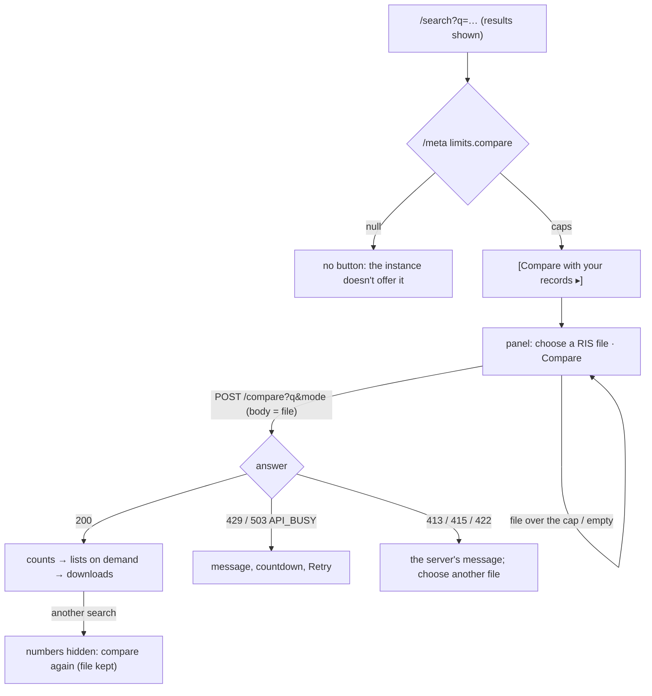

# Compare with your records — design

Status: **draft, built** (not yet through the heuristic pass or a review gate) · Backlog: TASK-177 · Spec: 04
§Comparing with a RIS file; 05 §Components 9; 07 §B · Index: [search workspace](2026-09-27-search-workspace.md)

## Problem and job

| Persona | JTBD | Risk removed |
|---|---|---|
| Lead reviewer moving from Google Scholar | When I try a query here, I want to see what it does to the records I already hold (which it keeps, drops and adds), so I can decide whether to adopt it and say what changed | adopting a string that silently loses papers already screened; reading "dropped" as "irrelevant" |
| Operator of a public instance | When I host this for others, I want to decide whether strangers may upload files to my server | an upload endpoint that is on because the software shipped it |

**Evidence.** On 2026-10-04 the question was answered for the Trust-Evals review by script, from
[`docs/results/2026-10-04-scholar-comparison.md`](../results/2026-10-04-scholar-comparison.md): the review's `$`
string keeps 51 of the export's papers and adds 16. Everything else here is an assumption until a reviewer
other than the owner uses it (see Open questions).

## Options considered

**Where the comparison runs and what the API looks like**

| | A. One request, the file as the raw body, everything in the answer (built) | B. A multipart upload, and one request per export |
|---|---|---|
| Shape | `POST /compare?q=&mode=`, body = the RIS bytes; the answer has the counts, the lists, each list's CSV text and the added papers' RIS | `POST /compare` with a form (`file`, `q`, `mode`); `…/export?list=&format=` re-uploads the file per download |
| For | no form parser (Starlette's spools parts over 1 MB to disk: the file would be written); the bytes are capped as they arrive and can be refused before they are read; one comparison (about 10 s of CPU per 1,000 records) answers every later click; nothing needs keeping between requests | the browser's native upload; smaller first answer |
| Against | the answer is larger (the lists twice: rows and CSV text); a binary body is typed `string` in the generated client | writes to disk, a parser to defend, and every download repeats the upload and the whole comparison, or the server must keep the file or the result (which the owner ruled out) |
| Guarantee at risk | none: the result is `engine.match_ids` as `/search` counts it (5) | the same, plus the "never stored" promise |

**Where the match table lives** (matching a file needs each index record's merge keys; building them reads
the whole snapshot: 13 s and about 80 MB for 95,877 records)

| | A. On the served bundle, built in the background after the swap (built) | B. Built inside the load, before the swap | C. Per request, or lazily on the first one |
|---|---|---|---|
| For | searches are served at once; one reference holds engine, records and table of one `index_version`, so a hot swap can't pair one index's result with another's table; no cost while comparisons are off | never a "not ready" answer | no startup cost |
| Against | a comparison in the first seconds after a load is told to retry (503 with `Retry-After`) | every start and every promotion serves 13 s later, for a feature most instances have off | the first reviewer waits (or every one does: the CLI run measured ~67 s); a lock and a timeout to get right |
| Guarantee at risk | none | none | 4, if the cache were keyed by version and read after a swap |

## Flow



`q` never changes: comparing is not a filter and is not in the URL (guarantee 3: the URL still describes the
result set, and the comparison is about it).

## States

| State | Trigger | Shows |
|---|---|---|
| Not offered | `limits.compare` null | nothing (no button, no hint) |
| Closed | default | `[Compare with your records ▸]` beside Export and Save |
| Open, no file | button | what it does, the file input, `[Compare]` off, where the file goes, the caps |
| File refused locally | size 0 or over `max_body_bytes` | an alert with the size and the cap; nothing sent |
| Off | dirty draft or stale results | `[Compare]` off with the same reason Export shows |
| Running | Compare | "Comparing `<name>` (3.5 MB) with this search… up to 60 seconds", `[Cancel]` |
| Answered | 200 | C3 below |
| Refused | envelope | "The comparison didn't run. Nothing was compared." + the server's code and message; 429 and `API_BUSY` count down to Retry |
| No answer | not JSON / unreachable | the export's wording for the same case, Retry |
| Stale | `(q, mode, index)` changed | "The search changed since the last comparison…" (no numbers), file kept |
| Index moved | answer's `index_version` ≠ shown | refused in place: search again, then compare again |
| Total differs | same index, another `total` | refused in place, worded as a bug |
| Large list | thousands of rows | 100 rows, then "Show more (100 of 1,756 shown)"; downloads hold every row |
| Narrow | 320 px | the table is two columns; titles and file names wrap; no sideways scroll |

## Wireframes

C1, open:

```
[Export 67 ▾] [Save search record] [Compare with your records ▾]
┌──────────────────────────────────────────────────────────────────────────┐
│ Compare with your records                                                │
│ Choose a RIS file of papers you already hold, for example a Google       │
│ Scholar export. You will see which of them this search keeps, which it   │
│ drops and why, and which papers it adds.                                 │
│ RIS file  [Choose file] mended.ris                 [Compare]             │
│ The file is sent to this server for this one comparison. It is not       │
│ stored, not logged and not added to the index. Up to 16.0 MB and 5,000   │
│ records, UTF-8 RIS (Publish or Perish, Zotero and EndNote export it).    │
└──────────────────────────────────────────────────────────────────────────┘
```

C3, answered (numbers from the 2026-10-05 run on index `05a0541717f6`; each is an API field):

```
│ Comparison with mended.ris                                               │
│ 1,834 records read {records_total}, 1,815 papers compared {papers_total} │
│ with the 67 papers {total} of this search · index 05a0541717f6           │
│ Papers                                                          Count    │
│ Kept              in your file and in this search's results        51    │
│ Dropped           in your file and in the index, but not in …   1,756    │
│ Not in the index  in your file; the index has no record of …        8    │
│ Added             in this search's results, not in your file       16    │
│ Kept and added papers together are the 67 papers of this search. Left    │
│ out of the comparison: 19 records from other venues.                     │
│ ┌ What "dropped" means. The index holds the paper, and this search ┐     │
│ └ doesn't return it: … A dropped paper is not judged irrelevant …  ┘     │
│ ⚠ 21 of the 51 kept and 509 of the 1,756 dropped papers are in this      │
│   index only because a RIS file was imported into it (marked "import     │
│   only"). …                                                              │
│ ─ Kept · 51                                                              │
│   [Show the 51 kept papers] [Download CSV]                               │
│ ─ Dropped · 1,756                                                        │
│   2 matches only as another word form · 1,713 no exact match in its      │
│   title or abstract · 41 can't be decided automatically                  │
│   [Show the 1,756 dropped papers] [Download CSV]                         │
│ ─ Not in the index · 8        … ─ Added · 16  [Show…] [Download RIS] [Download CSV] │
│ ─ Not compared · 19           [Show the 19 records not compared] [Download CSV]     │
```

A row, opened: the title (a link to the paper page when the index holds it), then `ICLR 2024 · record 212 of
your file · matched by title, venue and year`, then the reason and the server's detail (`excluded by a
default filter — track=workshop`), then `import only · needs a person to decide` when they apply.

## Interaction spec

- **Keyboard.** The trigger is a button (`aria-expanded`, `aria-controls`); the panel is a labelled region.
  Tab order inside: file input → Compare (→ Cancel while running) → the answer. When the answer lands, focus
  moves to its heading (`tabindex="-1"`), so the next Tab is the first list's Show button. Every Show/Hide is a
  button with `aria-expanded`; Enter and Space work as on any button. No drag and drop: the native file input
  is the only way to choose a file, so there is nothing a keyboard can't do.
- **Screen reader.** A polite status region says "Comparing `<name>` with this search." then "Comparison done:
  51 kept, 1,756 dropped, 8 not in the index, 16 added." (or "The comparison didn't run." / "Comparison
  cancelled."). Refusals are `role="alert"`. The counts are a real table with a caption, row headers and
  right-aligned `tabular-nums`. Each download's accessible name says which list and how many ("Download CSV of
  the 1,756 dropped papers"); its visible text is the start of that name.
- **What changes the URL:** nothing.
- **Targets** are at least 24 × 24 px (`min-h-8` buttons).

## Copy (new strings; glossary additions in `ux-writing`: kept, dropped, added, not in the index, not compared, import only)

| Id | String |
|---|---|
| CM-1 | Trigger and heading: "Compare with your records" |
| CM-2 | Intro: "Choose a RIS file of papers you already hold, for example a Google Scholar export. You will see which of them this search keeps, which it drops and why, and which papers it adds." |
| CM-3 | Under the input: "The file is sent to this server for this one comparison. It is not stored, not logged and not added to the index. Up to `<max_body_bytes>` MB and `<max_records>` records, UTF-8 RIS (Publish or Perish, Zotero and EndNote export it)." |
| CM-4 | Meanings: Kept "in your file and in this search's results"; Dropped "in your file and in the index, but not in this search's results"; Not in the index "in your file; the index has no record of them, so the search can't find them"; Added "in this search's results, not in your file" |
| CM-5 | "What “dropped” means. The index holds the paper, and this search doesn't return it: the query's words are not in its title or abstract as written, or a default filter excludes it. Google Scholar also matches full text and other word forms, which this search never does. A dropped paper is not judged irrelevant: check the reasons before leaving it out of a review." |
| CM-6 | List buttons: "Show the 1,756 dropped papers" / "Hide the …"; "Show the 8 papers not in the index"; "Download CSV", "Download RIS" |
| CM-7 | Reasons (dropped): "excluded by a default filter", "no exact match in its title or abstract", "matches only as another word form", "matches only as Google Scholar reads the query", "can't be decided automatically", "the two matchers disagree (a bug in openproceedings)"; (added): "an exact match your file doesn't hold", "matches as this search reads the query, not as Google Scholar reads it", "its venue and year hit Google Scholar's 1,000-result cap in your file" |
| CM-8 | Import warning: "`<n>` of the `<kept>` kept and `<m>` of the `<dropped>` dropped papers are in this index only because a RIS file was imported into it (marked “import only”). Matching such a paper shows that the import holds it, not that the index covers it from its own sources." |
| CM-9 | Announcements: "Comparison done: `<k>` kept, `<d>` dropped, `<n>` not in the index, `<a>` added."; "The comparison didn't run."; "Comparison cancelled." |
| CM-10 | Running: "Comparing `<name>` (`<size>` MB) with this search… Each paper is checked against the query, so a large file can take up to `<max_seconds>` seconds." |
| CM-11 | Local refusals: "This file is empty. Choose a RIS export that holds records."; "This file is `<size>` MB; this server compares files up to `<cap>` MB. Export it without abstracts (only titles, venues, years and links are compared), or split it." |
| CM-12 | Refused: "The comparison didn't run. Nothing was compared." then the server's code and message |
| CM-17 | A 429 (the network's cooldown, decision-035; the server's message gives the seconds, the countdown follows `Retry-After`): "Comparisons are limited more tightly than searches: you can keep searching while you wait." |
| CM-13 | Stale: "The search changed since the last comparison, so its numbers are no longer shown. Compare again to see what the current query keeps, drops and adds." |
| CM-14 | Index moved: "The index changed after this search: the comparison ran on index `<a>`, and the results shown are from `<b>`, so its numbers are not shown. Search again, then compare again." |
| CM-15 | Total differs: "The comparison counted `<n>` papers for this search, not the `<m>` shown, on the same index. That shouldn't happen: it is a bug in openproceedings. Its numbers are not shown." |
| CM-16 | Not compared: "Records of your file that are not NeurIPS, ICLR or ICML papers as far as their venue and links say. They are in none of the lists above." |

Server messages (registry, shown verbatim) are in spec 04 §Error handling and `api/compare.py`.

## API fields needed

All exist (TASK-177): `GET /meta` `limits.compare`; `POST /compare` → `CompareResponse` (`*_total`,
`reason_totals`, the five lists, `csv`, `added_ris`).

## Evidence

Assumption, not evidence: that reviewers read "dropped" as a verdict unless told otherwise (hence CM-5 beside
the counts, not behind a disclosure). No study has been run; the wording follows the report's own distinction
between `full_text`, `stemming` and `filtered`.

## Heuristic pass

Not run yet (`usability-auditor`). Known weak points to look at: the panel is long once several lists are
open; the reasons' wording is Scholar-centric for a file that came from another database.

## Open questions

- Should a comparison be saved with a search record (the file's hash and the counts, never the file), so a
  methods section can cite "kept 51 of 1,815"? Not built: the owner ruled that nothing of the file is stored.
- The stemmer that stands for Google Scholar's is still an open owner decision (07 §B); `stemming` vs
  `full_text` counts move with it.
- A file from another database (Scopus, Web of Science) has DOIs, which the merge rules don't match on.
