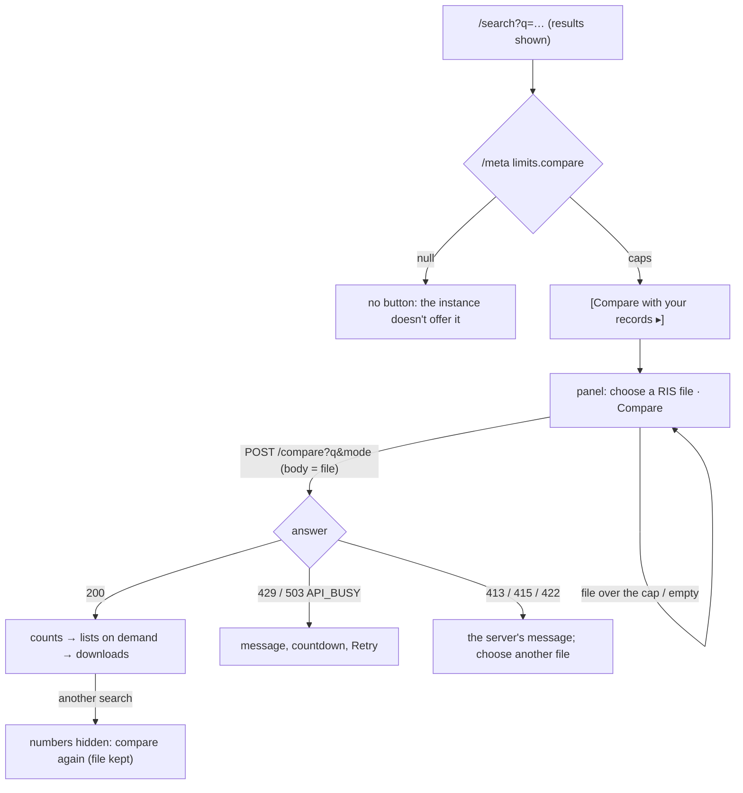

# Compare with your records — design

Status: **built; heuristic pass done** (the batch review gate's usability-auditor and ux-reviewer, 2026-10-05;
dispositions in §Heuristic pass) · Ethics: cleared (owner-reported 2026-09-27, TASK-032; file # not recorded); no
session on this panel yet · Backlog: TASK-177, follow-ups TASK-183–186 and
TASK-195 · Spec: 04 §Comparing with a RIS file; 05 §Components 9; 07 §B · Index:
[search workspace](2026-09-27-search-workspace.md) · Copy deck pointer: [copy deck §10](2026-09-27-copy-deck.md)

## Problem and job

| Persona | JTBD | Risk removed |
|---|---|---|
| Lead reviewer moving from Google Scholar | When I try a query here, I want to see what it does to the records I already hold (which it keeps, drops and adds), so I can decide whether to adopt it and say what changed | adopting a string that silently loses papers already screened; reading "dropped" as "irrelevant" |
| Operator of a public instance | When I host this for others, I want to decide whether strangers may upload files to my server | an upload endpoint that is on because the software shipped it |

**Evidence.** On 2026-10-04 the question was answered for the Trust-Evals review by script, from
[`docs/results/2026-10-04-scholar-comparison.md`](../results/2026-10-04-scholar-comparison.md): the review's `$`
string keeps 51 of the export's papers and adds 16. That is one team's one session (n=1). Everything else here,
that other reviewers ask the question and read the panel as meant, is an assumption until a reviewer other than
the owner uses it: the user research and usability rounds (TASK-032, TASK-047) carry the questions in §Open
questions.

## Options considered

**Where the comparison runs and what the API looks like**

| | A. One request, the file as the raw body, everything in the answer (built) | B. A multipart upload, and one request per export |
|---|---|---|
| Shape | `POST /compare?q=&mode=`, body = the RIS bytes; the answer has the counts, the lists, each list's CSV text and the added papers' RIS | `POST /compare` with a form (`file`, `q`, `mode`); `…/export?list=&format=` re-uploads the file per download |
| For | no form parser (Starlette's spools parts over 1 MB to disk: the file would be written); the bytes are capped as they arrive and can be refused before they are read; one comparison (about 10 s of CPU per 1,000 records) answers every later click; nothing needs keeping between requests | the browser's native upload; smaller first answer |
| Against | the answer is larger (the lists twice: rows and CSV text); a binary body is typed `string` in the generated client | writes to disk, a parser to defend, and every download repeats the upload and the whole comparison, or the server must keep the file or the result (which the owner ruled out) |
| Guarantee at risk | none: the result is `engine.match_ids` as `/search` counts it (5) | the same, plus the "never stored" promise |

**Where the match table lives** (matching a file needs each index record's merge keys; building them reads
the whole snapshot: 13 s and about 80 MB for 95,877 records)

| | A. On the served bundle, built in the background after the swap (built) | B. Built inside the load, before the swap | C. Per request, or lazily on the first one |
|---|---|---|---|
| For | searches are served at once; one reference holds engine, records and table of one `index_version`, so a hot swap can't pair one index's result with another's table; no cost while comparisons are off | never a "not ready" answer | no startup cost |
| Against | a comparison in the first seconds after a load is told to retry (503 with `Retry-After`) | every start and every promotion serves 13 s later, for a feature most instances have off | the first reviewer waits (or every one does: the CLI run measured ~67 s); a lock and a timeout to get right |
| Guarantee at risk | none | none | 4, if the cache were keyed by version and read after a swap |

## Flow



`q` never changes: comparing is not a filter and is not in the URL (guarantee 3: the URL still describes the
result set, and the comparison is about it).

## States

| State | Trigger | Shows |
|---|---|---|
| Not offered | `limits.compare` null | nothing (no button, no hint) |
| Closed | default | `[Compare with your records ▸]` beside Export and Save |
| Open, no file | button | what it does, the file input, `[Compare]` off, where the file goes, the caps |
| File refused locally | size 0 or over `max_body_bytes` | an alert with the size and the cap; nothing sent |
| Off | dirty draft or stale results | `[Compare]` off with the same reason Export shows |
| Running | Compare | "Comparing `<name>` (3.5 MB) with this search… up to 60 s. 12 s so far." (the counter ticks, hidden from screen readers), `[Cancel]` |
| Answered | 200 | C3 below |
| Refused | envelope | "The comparison didn't run. Nothing was compared." + the server's code and message; a 429 counts down to Retry; a 503 `API_BUSY` with `Retry-After` (every slot taken; a table still being built: its expected time left) retries by itself, up to 3 times in a row, and while a retry is to come says "The comparison hasn't run yet: this instance is busy; this page will try again by itself." with "Busy; retrying by itself in `<n>` s" (no alert); a 503 `API_BUSY` without `Retry-After` (the comparison ran past its time, or the table could not be built) is not retried by itself: Retry is offered at once; a press of Retry is announced ("Comparing `<file>` with this search.") and uses up none of the 3 retries by itself, nor starts their count over; a refusal of the file (413, 415, 422) offers no Retry: "Choose another file, then Compare." |
| Pausing | a 200 with `next_comparison_seconds` > 0 (`--compare`, or off loopback) | `[Compare]` off, beside it "Next comparison in 54 s: this instance pauses between one network's comparisons." counting down |
| No answer | not JSON / unreachable | the export's wording for the same case, Retry |
| Stale | `(q, mode, index)` changed | "The search changed since the last comparison…" (no numbers), file kept |
| Index moved | answer's `index_version` ≠ shown | refused in place, with `[Search again]` as the export's notice has |
| Total differs | same index, another `total` | refused in place, worded as a bug, with "Report it ▸" |
| Large list | thousands of rows | 100 rows, then "Show more (100 of 1,756 shown)"; downloads hold every row |
| Narrow | 320 px | the table is two columns; titles and file names wrap; no sideways scroll |

## Wireframes

C1, open:

```
[Export 67 ▾] [Save search record] [Compare with your records ▾]
┌──────────────────────────────────────────────────────────────────────────┐
│ Compare with your records                                                │
│ Choose a RIS file of papers you already hold, for example a Google       │
│ Scholar export. You will see which of them this search keeps, which it   │
│ drops and why, and which papers it adds.                                 │
│ RIS file  [Choose file] mended.ris                 [Compare]             │
│ The file is sent to this instance for this one comparison. It is not     │
│ stored, not logged and not added to the index. Up to 16.0 MB and 5,000   │
│ records, UTF-8 RIS (Publish or Perish, Zotero and EndNote export it).    │
└──────────────────────────────────────────────────────────────────────────┘
```

C3, answered (numbers from the 2026-10-05 run on index `05a0541717f6`; each is an API field):

```
│ Comparison with mended.ris                                               │
│ 1,834 records read {records_total}, 1,815 papers compared {papers_total} │
│ with the 67 papers {total} of this search · index 05a0541717f6           │
│ Papers                                                          Count    │
│ Kept              in your file and in this search's results        51    │
│ Dropped           in your file and in the index, but not in …   1,756    │
│ Not in the index  in your file; the index has no record of …        8    │
│ Added             in this search's results, not in your file       16    │
│ Kept and added papers together are the 67 papers of this search. Left    │
│ out of the comparison: 19 records from other venues.                     │
│ ┌ What "dropped" means. The index holds the paper, and this search ┐     │
│ └ doesn't return it: … A dropped paper is not judged irrelevant …  ┘     │
│ ⚠ 21 of the 51 kept and 509 of the 1,756 dropped papers are in this      │
│   index only because a RIS file was imported into it (marked "import     │
│   only"). …                                                              │
│ This comparison in one sentence, for your notes … [Copy]                 │
│ ─ Kept · 51                                                              │
│   [List the 51 kept papers ▸] [Download CSV]                             │
│ ─ Dropped · 1,756                                                        │
│   2 papers match only as another word form: type * after its stem (e.g.  │
│   evaluat*) to match its other forms; $ adds only one letter or digit    │
│   (the Add $ action under the query).                                    │
│   1,713 papers have no exact match in their title or abstract: no form   │
│   of this query finds such a paper …; keep it from your own file …       │
│   [List the 1,756 dropped papers ▸] [Download CSV]                       │
│ ─ Not in the index · 8        … ─ Added · 16  [List…] [Download RIS] [Download CSV] │
│ ─ Not compared · 19           [List the 19 records not compared ▸] [Download CSV]   │
```

A row, opened: the title (a link to the paper page when the index holds it, opened in a new tab and saying so:
the comparison lives on this page only, so a same-tab link and Back would lose it and the chosen file), then `ICLR 2024 · record 212 of
your file · matched by title, venue and year`, then the reason and the server's detail (`excluded by a
default filter — track=workshop`; a missing paper's evidence without what its match line already says), then
`import only · to check: is it in the index under another title, venue or year?` when they apply (the
question named, never "needs a person to decide"). The `·` between facts is hidden from screen readers, which
read "; " instead.

## Interaction spec

- **Keyboard.** The trigger is a button (`aria-expanded`, `aria-controls`); the panel is a labelled region.
  Tab order inside: file input → Compare (→ Cancel while running) → the answer. When the answer lands, focus
  moves to its heading (`tabindex="-1"`), so the next Tab is the summary's Copy, then the first list's toggle. A control that removes
  itself never drops focus to the page: Cancel and Retry hand it to Compare, and the last "Show more" to the
  first row it drew (`tabindex="-1"`). Each list's toggle is one button whose name never changes ("List the 51
  kept papers"), its state in `aria-expanded` and the arrow; Enter and Space work as on any button. An
  `aria-disabled` Compare always says why beside it ("Choose a RIS file first.", "Choose a smaller file.", the
  pause), and the file input is `aria-invalid` while its file is refused. No drag and drop: the native file input
  is the only way to choose a file, so there is nothing a keyboard can't do.
- **Screen reader.** A polite status region (beside the panel, not in it, so an answer that lands while the
  panel is closed is still announced; the heading then takes no focus) says "Comparing `<name>` with this search." then "Comparison done:
  51 kept, 1,756 dropped, 8 not in the index, 16 added." (or "The comparison didn't run." / "Comparison
  cancelled."). Refusals are `role="alert"`, but for a busy server's wait that ends in a retry by itself: that
  is one polite "Busy; retrying by itself in `<n>` s." in the same region, and the retry is not announced as
  "Comparing…" again, since a busy server can be met several times in a row (A11Y-R2-2). A retry by itself
  moves focus only off the notice it replaces, and its answer takes focus only from Compare or from nowhere,
  never from wherever the reader went while it waited (A11Y-R2-1). An `aria-disabled` Compare sends nothing
  when pressed (USAB-R2-2). The counts are a real table with a caption, row headers and
  right-aligned `tabular-nums`. Each download's accessible name says which list and how many ("Download CSV of
  the 1,756 dropped papers"); its visible text is the start of that name.
- **What changes the URL:** nothing.
- **Targets** are at least 24 × 24 px (`min-h-8` buttons).

## Copy (new strings; glossary additions in `ux-writing`: kept, dropped, added, not in the index, not compared, import only)

| Id | String |
|---|---|
| CM-1 | Trigger and heading: "Compare with your records" |
| CM-2 | Intro: "Choose a RIS file of papers you already hold, for example a Google Scholar export. You will see which of them this search keeps, which it drops and why, and which papers it adds." |
| CM-3 | Under the input: "The file is sent to this instance for this one comparison. It is not stored, not logged and not added to the index. Up to `<max_body_bytes>` MB and `<max_records>` records, UTF-8 RIS (Publish or Perish, Zotero and EndNote export it); the file must arrive within `<max_upload_seconds>` s." (TASK-184 sends the upload limit) |
| CM-4 | Meanings: Kept "in your file and in this search's results"; Dropped "in your file and in the index, but not in this search's results"; Not in the index "in your file; the index has no record of them, so the search can't find them"; Added "in this search's results, not in your file" |
| CM-5 | "What “dropped” means. The index holds the paper, and this search doesn't return it: the query's words are not in its title or abstract as written (other word forms only where the query asks for them, with $ or *), or a default filter excludes it. Google Scholar also matches full text and other word forms. A dropped paper is not judged irrelevant: check the reasons before leaving it out of a review." |
| CM-6 | List toggles (one name, state in `aria-expanded`): "List the 1,756 dropped papers ▸/▾"; "List the 8 papers not in the index"; "Download CSV", "Download RIS" |
| CM-7 | Reasons on a row (dropped): "outside a limit your query writes (its year, venue, track or status)", "excluded by a default filter", "no exact match in its title or abstract", "matches only as another word form", "matches only as Google Scholar reads the query", "can't be decided automatically", "openproceedings judges it both ways (a bug: please report it)"; (not in the index) "not in the index", and for `query_limit`, judged on the file's own venue and year (TASK-185), "not in the index; its year or venue in your file is outside a limit your query writes"; (added): "an exact match your file doesn't hold", "matches as this search reads the query, not as Google Scholar reads it", "its venue and year hit Google Scholar's 1,000-result cap in your file" |
| CM-8 | Import warning: "`<n>` of the `<kept>` kept and `<m>` of the `<dropped>` dropped papers are in this index only because a RIS file was imported into it (marked “import only”). Matching such a paper shows that the import holds it, not that the index covers it from its own sources." |
| CM-9 | Announcements: "Comparison done: `<k>` kept, `<d>` dropped, `<n>` not in the index, `<a>` added."; "The comparison didn't run."; "Busy; retrying by itself in `<n>` s." (a busy wait that ends in a retry by itself, instead of "didn't run"); "Comparison cancelled." |
| CM-10 | Running: "Comparing `<name>` (`<size>` MB) with this search… Each paper is checked against the query, so a large file can take up to `<max_seconds>` s." then "`<n>` s so far." (not announced) |
| CM-11 | Local refusals: "This file is empty. Choose a RIS export that holds records."; "This file is `<size>` MB; this instance compares files up to `<cap>` MB. Export it without abstracts (only titles, venues, years and links are compared), or split it." |
| CM-12 | Refused: "The comparison didn't run. Nothing was compared." then the server's code and message. With an earlier answer for the same search still shown: "The new comparison didn't run. The results below are from the earlier comparison with `<its file>`." A refusal of the file adds "Choose another file, then Compare." (no Retry); `API_COMPARE_TOO_COSTLY` adds "Compare a smaller file, or narrow the query and search again." While a busy server's retry by itself is still to come (A11Y-R2-2): "The comparison hasn't run yet: this instance is busy; this page will try again by itself." (or "The new comparison hasn't run yet: …" before the earlier-results sentence), then the server's message without its closing "Try again in `<s>` s." (the countdown says when) and "Busy; retrying by itself in `<n>` s", then "Retrying…" |
| CM-13 | Stale: "The search changed since the last comparison, so its numbers are no longer shown. Compare again to see what the current query keeps, drops and adds." |
| CM-14 | Index moved: "The index changed after this search: the comparison ran on index `<a>`, and the results shown are from `<b>`, so its numbers are not shown. Search again, then compare again." `[Search again]` |
| CM-15 | Total differs: "The comparison counted `<n>` papers for this search, not the `<m>` shown, on the same index. That shouldn't happen: it is a bug in openproceedings. Its numbers are not shown." "Report it ▸" |
| CM-16 | Not compared: "Records of your file that are not NeurIPS, ICLR or ICML papers as far as their venue and links say. They are in none of the lists above." |
| CM-17 | Retired (UX-S1): the client's own 429 line ("…you can keep searching while you wait") was untrue for a token-bucket 429; the server's cooldown message says "searching is not affected" itself. |
| CM-18 | A list's reasons, each count a sentence of its own (singular for 1), followed by CM-19's step: dropped "`<n>` papers are outside a limit your query writes", "… are excluded by a default filter", "… have no exact match in their title or abstract", "… match only as another word form", "… match only as Google Scholar reads the query", "… can't be decided automatically", "… are judged both ways by openproceedings (a bug: please report it)"; not in the index "… are not in the index", and for `query_limit` "… are not in the index, and their year or venue in your file is outside a limit your query writes" (one: "1 paper is not in the index, and its year or venue …"); added "… match exactly and are not in your file", "… match as this search reads the query, not as Google Scholar reads it", "… are from a venue and year that hit Google Scholar's 1,000-result cap in your file" |
| CM-19 | What to do, after a dropped or missing count (USAB-S3): query limit (dropped) "to include such a paper, widen that limit in the query (its row names the clause)"; filtered "to include such a paper, write its track or status into the query (its row says which)"; full text "no form of this query finds such a paper by its title or abstract; keep it from your own file if it belongs in the review"; word form "type * after its stem (e.g. evaluat*) to match its other forms; $ adds only one letter or digit" (a word form can be any number of letters longer, as `evaluated` or `evaluating`, and `$` reaches only one more; R3-2), and in Scholar mode, where the Add $ action is, the same followed by "(the Add $ action under the query)" (USAB-R2-1); Scholar's reading "write the query as Google Scholar reads it (its translation notice shows how) to match such a paper"; not in the index, a sentence of its own after the count ("3 papers are not in the index. Keep such a paper from your own file; no query here can find it."; USAB-R2-N), the same step for a `query_limit` paper not in the index (widening the limit can never find a paper the index doesn't hold; batch B gate, UX/USAB); undecided "check such a paper by hand (its row says what is undecided)"; a bug "please report it with this query" |
| CM-20 | What is undecided, on a row (UX-S4): "to check: is it in the index under another title, venue or year?" (not in the index); "to check: does the paper itself match the query? (its row says what is undecided)" (dropped); "to check: is it the paper your file holds under another record?" (added); "to report: openproceedings judged it both ways" |
| CM-21 | Summary (USAB-S7; TASK-195, decision-043): "This comparison in one sentence, to cite beside your file (nothing of it is kept here, and a saved search record doesn't note it):" (the figcaption, which also names the box), the sentence in a read-only text box sized to it that the keyboard reaches, `[Copy]` ("Copied"; where the clipboard can't be written it focuses and selects the box: "Couldn't copy: the text is selected; copy it with Ctrl+C (⌘C on a Mac)") → "As a search-development check (not a PRISMA flow-diagram count), on `<date>` (UTC) we compared the RIS file `<file>` (sha256 `<sha256>`; `<r>` records read: `<p>` papers compared, `<x>` not compared for a venue or year out of scope, and `<d>` repeats of a paper already counted) with the query `<canonical>` (canonical_hash `<hash>`) on openproceedings (index `<v>`): `<k>` kept, `<d>` dropped, `<n>` not in the index, and `<a>` papers added that the file doesn't hold." Without Web Crypto the hash reads "sha256 not computed by this browser: compute it from your copy". The file's records are all accounted for (`<r>` = `<p>` + `<x>` + `<d>`, the server's `papers_total`, `not_compared_total` and `duplicates_total`; a Web of Science file's unmatched records are mostly not compared); the repeats clause is left out when there are none ("`<p>` papers compared and `<x>` not compared …"). |
| CM-22 | Why Compare is off, beside it (A11Y-S5, USAB-S2): "Choose a RIS file first."; "Choose a smaller file."; "Next comparison in `<n>` s: this instance pauses between one network's comparisons."; or the search page's own reason (a dirty draft, stale results) |

Units: sizes in the panel are MB or KB to one decimal (binary, as the caps are); the server's own messages give
exact bytes, which the panel shows verbatim. Times are "s" everywhere in the panel, as in the server's
messages and the countdown.

Server messages (registry, shown verbatim) are in spec 04 §Error handling and `api/compare.py`.

## API fields needed

All exist (TASK-177): `GET /meta` `limits.compare`; `POST /compare` → `CompareResponse` (`*_total`,
`reason_totals`, the five lists, `csv`, `added_ris`, and `next_comparison_seconds`, added by the gate's
USAB-S2).

## Evidence

Assumption, not evidence: that reviewers read "dropped" as a verdict unless told otherwise (hence CM-5 beside
the counts, not behind a disclosure), and that a next step per reason (CM-19) is what they need to act. No
study has been run (n=1: the owner's own session); the wording follows the report's own distinction between
`full_text`, `stemming` and `filtered`. Untested; for the usability test (TASK-047).

## Heuristic pass

Done 2026-10-05 by the batch review gate's `usability-auditor` and `ux-reviewer` (Nielsen's ten and the six
search heuristics, `heuristic-evaluation`), on the built panel. Dispositions:

| Finding | Severity | Disposition |
|---|---|---|
| USAB-M1 a row's title was a same-tab link: Back lost the comparison and its file | Must | fixed: new tab, said in the link's name |
| A11Y-M1–M3 Cancel, Retry and the last Show more dropped focus to the page | Must | fixed: Compare, Compare, the first row drawn |
| USAB-S2 a 54 s pause read as a bug on a local instance | Should | fixed (owner's decision): no pause on a local instance; the pause said beside Compare |
| USAB-S3 a dropped reason said a cause, no next step | Should | fixed: CM-19 |
| USAB-S7 the counts can't be kept | Should | fixed: CM-21's citable sentence with the file's sha256 (TASK-195); a search record never notes a comparison (decision-043) |
| USAB-S8 a static "running" line; a fixed 5 s retry while the table builds | Should | fixed: a counter; the build's expected time; retried by itself |
| UX-S1 "you can keep searching" on every 429 | Should | fixed: CM-17 retired |
| UX-S4 "needs a person to decide" never said what | Should | fixed: CM-20 |
| UX-S5 no Search again or Report where export has them; internal "two matchers" | Should | fixed: CM-14, CM-15, CM-7 |
| UX-S6 "this server" beside "this instance" | Should | fixed: "this instance" |
| UX-S7 CM-5 said this search never matches other word forms (wrong with $ or *) | Should | fixed |
| A11Y-S5, S6, N9, N10 | Should/Nit | fixed: the reason beside Compare; the live region outside the panel; `·` hidden; one toggle name |
| USAB-N1 a refused file offered Retry with the same file | Nit | fixed: "Choose another file" |
| USAB-N3, UX-N the missing paper's row said the same thing twice; units | Nit | fixed: CM-10, units line |
| Long panel with several lists open; Scholar-centric reasons for Scopus/WoS files; "records" naming; "dropped" as a verdict | research question | for TASK-032/TASK-047 (§Open questions), not a fix |
| USAB-R2-1 the word-form step named an Add $ action native mode doesn't have | Should | fixed: CM-19 by mode |
| USAB-R2-2 Compare, aria-disabled during the pause, still sent the file | Should | fixed |
| USAB-R2-N two colons in the not-in-the-index line | Nit | fixed: CM-19 |
| A11Y-R2-1 a retry by itself moved focus; A11Y-R2-2 an alert per busy cycle, "didn't run" while a retry was to come | Should | fixed: CM-9, CM-12, §Interaction spec |
| R3-1 a press of Retry on a busy notice ran as a retry by itself: not announced, and it used up one | Should | fixed: §Interaction spec |
| R3-2 the word-form step said $ matches "its other forms", but -ed and -ing forms are more than one letter longer | Should | fixed: CM-19 names `*` |
| R3 nits "it will try again by itself" (the page does); the server's "Try again in N s." beside the countdown | Nit | fixed: CM-12 |

## Decided

- The stemmer that stands for Google Scholar's (decision-038: inflected forms only); `stemming` vs
  `full_text` counts move if it changes.

## Open questions

- Should a comparison be saved with a search record (the file's hash and the counts, never the file), so a
  methods section can cite "kept 51 of 1,815"? Decided (decision-043, 2026-10-05): no. A search record never
  notes a comparison; CM-21's sentence, with the file's sha256 computed in the browser, is the citable form
  (TASK-195).
- A file from another database (Scopus, Web of Science) has DOIs, which the merge rules don't match on
  (TASK-186), and the reasons are worded for Scholar.
- For the user research and usability rounds (TASK-032, TASK-047; each needs ORE clearance first): do reviewers
  read "dropped" as a verdict; do they call their file's entries "records" or "papers"; is the panel too long
  with several lists open; does the next step after each reason lead them to act on it.
